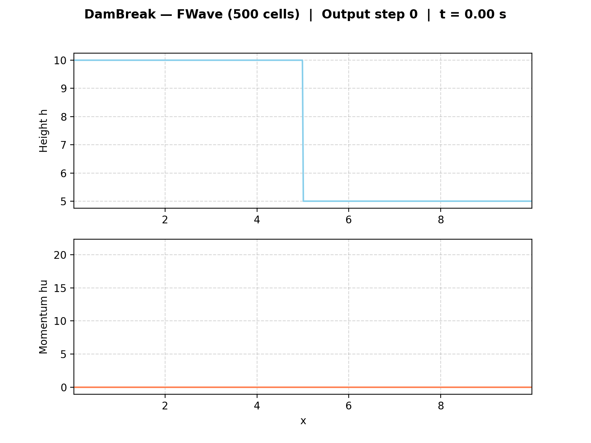
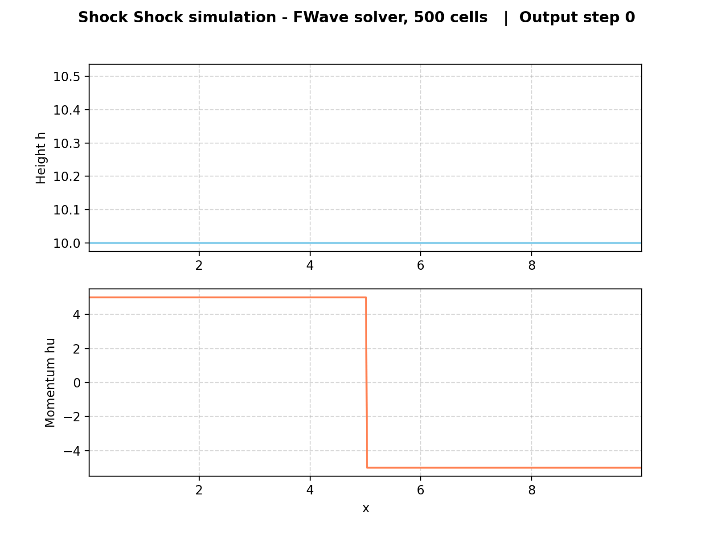
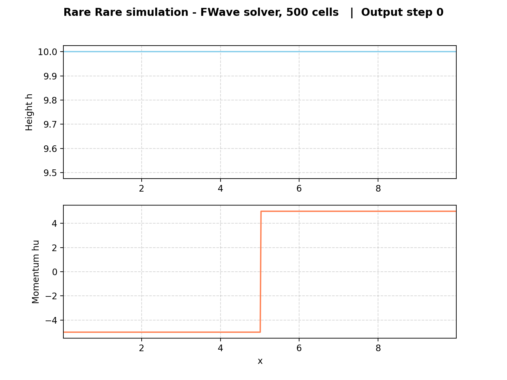

2. Finite Volume Discretization
================================

Implementation
--------------

Unit Tests
----------

Results & Visualizations
------------------------

Dambreak simulation with FWave solver and 500 cells
^^^^^^^^^^^^^^^^^^^^^^^^^^^^^^^^^^^^^^^^^^^^^^^^^^^

Shock Shock simulation with FWave solver and 500 cells
^^^^^^^^^^^^^^^^^^^^^^^^^^^^^^^^^^^^^^^^^^^^^^^^^^^

Rare Rare simulation with FWave solver and 500 cells
^^^^^^^^^^^^^^^^^^^^^^^^^^^^^^^^^^^^^^^^^^^^^^^^^^^

Individual Contributions
------------------------

- **Yannik Köllmann:**
- **Jan Vogt:**
- **Mika Brückner:** Integration of f-wave solver into ``WavePropagation1d.h``, ``WavePropagation1d.cpp`` and ``WavePropagation1d.test.cpp`` (``[WaveProp1dFWave]``).
  Implementation of commandline arguments with flags for problem and solver mode to ``main.cpp``.
  Implementation of ``visualize_simulation.py`` script for visualizing simulation results from ``main.cpp``.
  Simulations and visualizations for Dambreak, ShockShock and RareRare problem with f-wave solver.
