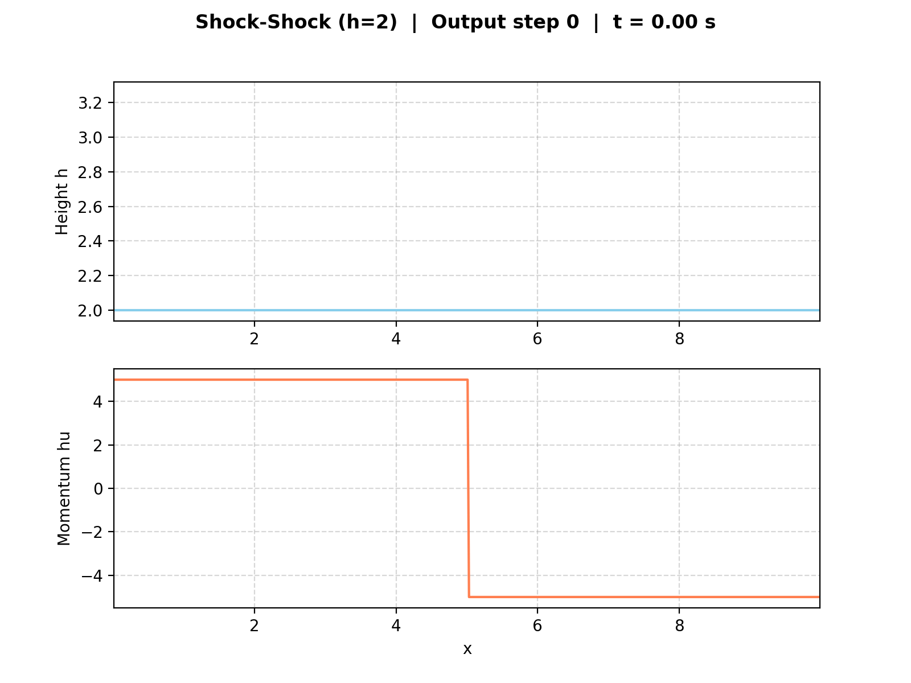
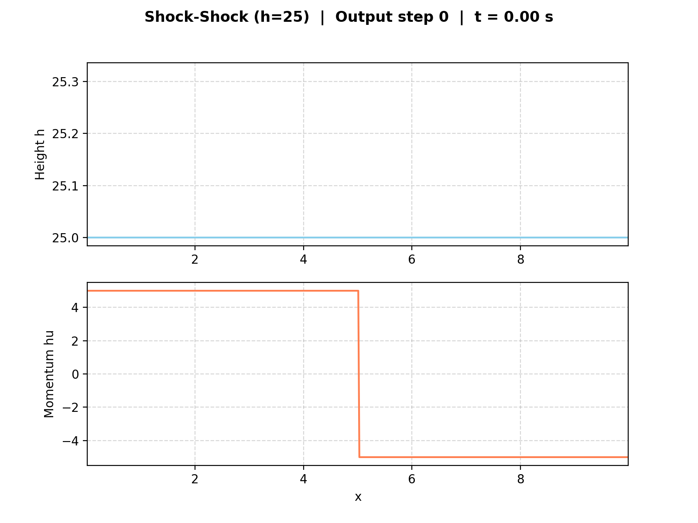
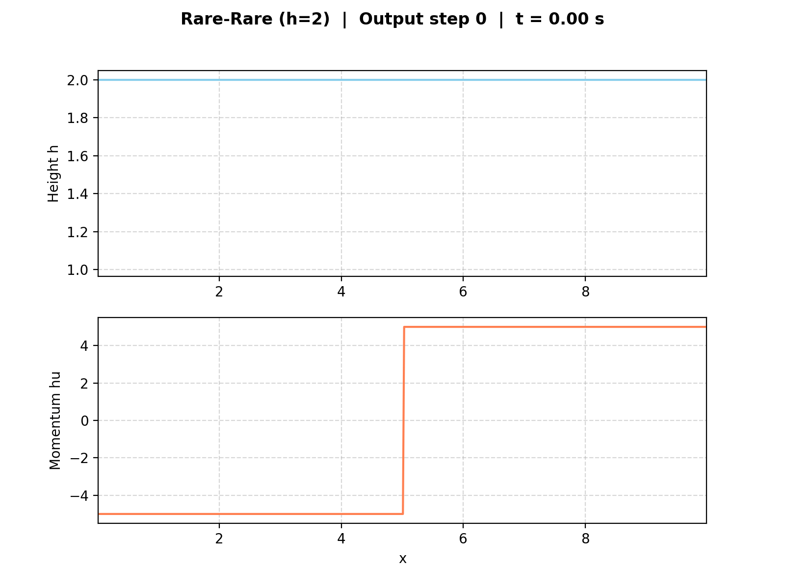
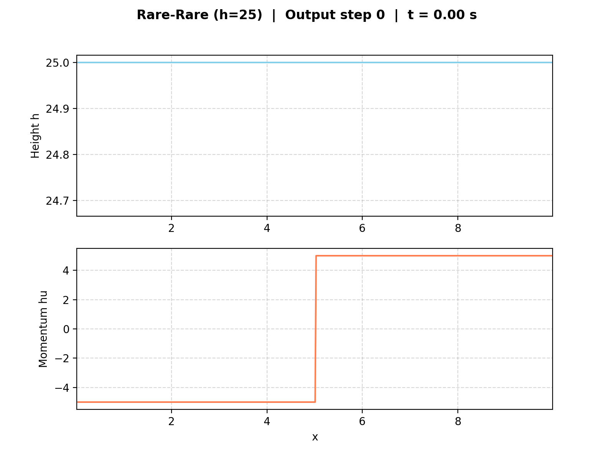

2. Finite Volume Discretization
================================

Implementation
--------------

The one-dimensional finite volume discretization is realized in
``WavePropagation1d``, which manages cell quantities, ghost cells, and
the time-step update. The solver can be switched between Roe and
f-wave at runtime.

``DamBreak1d`` supports independently configurable heights and momenta
on both sides, covering both the classical dam break and the 2.2.2
evacuation scenario. ``ShockShock1d`` and ``RareRare1d`` are symmetric
Riemann setups with antisymmetric momentum. All setups use the
convention :math:`x \leq x_{\text{dis}}` for the left state.

The CLI in ``main.cpp`` selects a setup via ``-p``; domain size and
end time are set via ``-d`` and ``-t``. CSV snapshots are written at
every 0.5% of total time steps, each annotated with a
``# sim_time=...`` header.

Unit Tests
----------

Each setup has its own test file (``[DamBreak1d]``,
``[ShockShock1d]``, ``[RareRare1d]``) covering constant heights,
momentum signs, antisymmetry, left-state assignment of the
discontinuity cell, zero y-momentum, and time-independence of the
initial state.

Middle-State Sanity Check
-------------------------

A dedicated Catch2 test case (``[MiddleStates]``) reads
``middle_states.csv``, runs the f-wave solver on each listed Riemann
problem, and compares the computed middle state height :math:`h^*`
against the reference within a relative tolerance of :math:`10^{-3}`.
The solver passes across the full data set.

Results & Visualizations
------------------------

Dambreak simulation with FWave solver and 500 cells
^^^^^^^^^^^^^^^^^^^^^^^^^^^^^^^^^^^^^^^^^^^^^^^^^^^

Setup: ``./build/tsunami_lab -n 500 -s FWave -p DamBreak 10 5 5``.
The solution splits into a left-going rarefaction and a right-going
shock.

.. image:: ../../../simulations/visualizations/dambreak_fwave_500.gif

Shock Shock simulation with FWave solver and 500 cells
^^^^^^^^^^^^^^^^^^^^^^^^^^^^^^^^^^^^^^^^^^^^^^^^^^^^^^

Setup: ``./build/tsunami_lab -n 500 -s FWave -p ShockShock 10 5 5``.
Two outgoing shocks with a raised middle state.

.. image:: ../../../simulations/visualizations/shockshock_fwave_500.gif

Height variation (:math:`h = 2` vs. :math:`h = 25`, :math:`hu = 5`):
the lower height produces slower but proportionally stronger shocks,
while the larger height yields faster but weaker ones — matching
:math:`\lambda_{1/2} = u \mp \sqrt{gh}`.

Rare Rare simulation with FWave solver and 500 cells
^^^^^^^^^^^^^^^^^^^^^^^^^^^^^^^^^^^^^^^^^^^^^^^^^^^^

Setup: ``./build/tsunami_lab -n 500 -s FWave -p RareRare 10 5 5``.
Two outgoing rarefactions with a lowered middle state.

.. image:: ../../../simulations/visualizations/rarerare_fwave_500.gif

Height variation (:math:`h = 2` vs. :math:`h = 25`, :math:`hu = 5`):
at :math:`h = 2` the rarefactions are slow and the middle state
drops sharply (close to dry-bed limit); at :math:`h = 25` they
spread fast and the middle state barely deviates from :math:`h_l`.

Village Evacuation Time
^^^^^^^^^^^^^^^^^^^^^^^^^^^^^
Setup:
""""""
Dam at :math:`x=5000m`, village at :math:`x=30000m`,
:math:`s_{village} = 25000m`. Initial state: :math:`h_l = 14m`,
:math:`h_r = 3.5m`, :math:`hu_l = 0`, :math:`hu_r = 0.7 m^2/s`.
Evacuation time is estimated via the speed of the right-going wave.

Theoretical Estimate (2.2.2):
"""""""""""""""""""""""""""""
.. math::

  s_{village} &= 25000m \\\\
  q_l &= \begin{bmatrix} 14 \\ 0 \end{bmatrix},\ q_r = \begin{bmatrix} 3.5 \\ 0.7 \end{bmatrix}\\
  u_r &= \frac{hu_r}{h_r} = \frac{0.7}{3.5} = 0.2 \frac{m}{s}\\\\
  h^{Roe} &= \frac{1}{2} (h_l + h_r) = \frac{1}{2} (14 + 3.5) = 8.75 m \\
  u^{Roe} &= \frac{u_l \sqrt{h_l} + u_r \sqrt{h_r}}{\sqrt{h_l}+\sqrt{h_r}} = \frac{0 \cdot \sqrt{14} + 0.2 \cdot \sqrt{3.5}}{\sqrt{14}+\sqrt{3.5}} = 0.06667 \frac{m}{s}\\\\
  \lambda_r^{Roe} &= u^{Roe} + \sqrt{gh^{Roe}} = 0.06667 + \sqrt{9.80665 \cdot 8.75} = 9.32994 \frac{m}{s} \\
  t_{evac} &= \frac{s_{village}}{\lambda_r^{Roe}} = \frac{25000m}{9.32994} = 2679.54 s \approx 44.66 min

Simulation:
""""""""""
Setup: ``./build/tsunami_lab -n 30000 -d 30000 -t 2400 -p DamBreak 14 3.5 5000 0 0.7``.
The shock front reaches the village (:math:`x=30000`) at
:math:`t \approx 2256 s (\sim 37.6 min)`.

.. image:: ../../../simulations/visualizations/evacuation_problem.gif

Results:
""""""""

The analytical estimate yields :math:`\sim 44.66 min`, while the
simulation shows the shock arriving :math:`\sim 7 min` earlier at
:math:`\sim 37.6 min`. This is expected, as :math:`\lambda_r^{Roe}`
underestimates the true shock speed because the shock propagates
through water already set in motion by the dam break.

Individual Contributions
------------------------

- **Yannik Köllmann:** Implementation of 2.1.1 setups ``ShockShock1d`` and ``RareRare1d``
  (``[ShockShock1d]``, ``[RareRare1d]``) with corresponding unit tests, copied from the
  ``DamBreak1d`` template and adapted for shock-shock and rare-rare Riemann problems.
  Extension of ``DamBreak1d`` with configurable left and right momentum parameters
  (``m_momentumLeft``, ``m_momentumRight``) to enable setups such as the 2.2.2 evacuation
  scenario with a pre-existing river flow. Added corresponding unit tests and updated
  the command-line interface in ``main.cpp`` to accept optional ``huLeft``/``huRight``
  arguments. Integrated the new setup files into the SCons build configuration.
- **Jan Vogt:** Implementation of the middle-state sanity check against
  ``middle_states.csv`` as a Catch2 test case (``[MiddleStates]``),
  verifying the computed middle state height :math:`h^*` within the
  chosen tolerance. Generation of the GIF visualizations for the
  dam-break, shock-shock, rare-rare, and evacuation-problem
  simulations. Writing of this chapter's documentation, including
  the parameter-study observations.
- **Mika Brückner:** Integration of f-wave solver into ``WavePropagation1d.h``, ``WavePropagation1d.cpp`` and ``WavePropagation1d.test.cpp`` (``[WaveProp1dFWave]``) for task 2.1.
  Implementation of commandline arguments in ``main.cpp``.
  Implementation of ``visualize_simulation.py`` script for visualizing simulation results from ``main.cpp``.
  Simulation, visualization and calculation of evacuation time for the 2.2.2 scenario with f-wave solver.