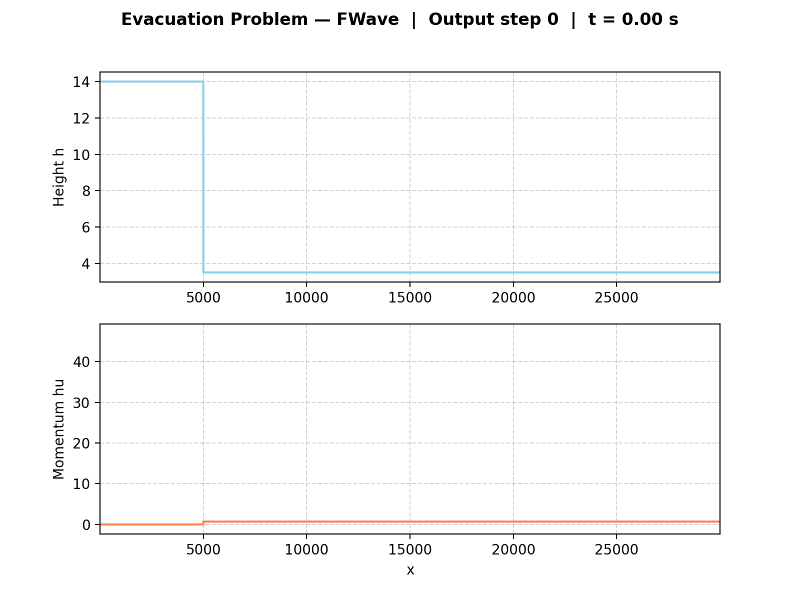

2. Finite Volume Discretization
================================

Implementation
--------------

The one-dimensional finite volume discretization is realized in
``WavePropagation1d``, which manages the cell quantities, two ghost
cells at each boundary, and the time-step update. The update iterates
over all :math:`n+1` edges, invokes the selected Riemann solver, and
applies the returned net-updates to the neighbouring cells. The solver
can be switched between Roe and f-wave at runtime via a string
parameter passed to ``timeStep``.

Three Riemann setups are provided. ``DamBreak1d`` (Sec. 2.2) supports
independently configurable water heights and momenta on both sides,
which covers both the classical dam break and the 2.2.2 evacuation
scenario with a pre-existing river flow (``q_r = [3.5, 0.7]``).
``ShockShock1d`` and ``RareRare1d`` (Sec. 2.1) are symmetric Riemann
problems with equal water height on both sides and antisymmetric
momentum — the two streams move towards each other (shock-shock) or
away from each other (rare-rare). All setups follow the convention
:math:`x \leq x_{\text{dis}}` for the left state.

The command-line interface in ``main.cpp`` selects a setup via ``-p``
with its parameters as positional arguments. For ``DamBreak``, the
momenta on both sides are optional (default zero), so the classical
dam break and the evacuation scenario (Section 2.2.2) use the same
setup class. The domain size and simulation end time are configurable
via ``-d`` and ``-t`` respectively, defaulting to ``10.0 m`` and
``1.25 s``. Simulation results are written as CSV snapshots at every 0.5% of total time
steps, each annotated with the current simulation time via a
``# sim_time=...`` comment in the first line.

Unit Tests
----------

Each setup has its own test file tagged with the class name
(``[DamBreak1d]``, ``[ShockShock1d]``, ``[RareRare1d]``). The tests
are organized into Catch2 ``SECTION`` blocks covering constant height
on both sides, the expected sign of the momentum on each side,
antisymmetry across the discontinuity, assignment of the discontinuity
cell itself to the left state, zero y-momentum, and time-independence
of the initial state. ``DamBreak1d`` additionally has a test case for
the extended signature with non-zero momentum on both sides.

Results & Visualizations
------------------------

Dambreak simulation with FWave solver and 500 cells
^^^^^^^^^^^^^^^^^^^^^^^^^^^^^^^^^^^^^^^^^^^^^^^^^^^

.. image:: ../../../simulations/visualizations/dambreak_fwave_500.gif

Shock Shock simulation with FWave solver and 500 cells
^^^^^^^^^^^^^^^^^^^^^^^^^^^^^^^^^^^^^^^^^^^^^^^^^^^

.. image:: ../../../simulations/visualizations/shockshock_fwave_500.gif

Rare Rare simulation with FWave solver and 500 cells
^^^^^^^^^^^^^^^^^^^^^^^^^^^^^^^^^^^^^^^^^^^^^^^^^^^

.. image:: ../../../simulations/visualizations/rarerare_fwave_500.gif

Village Evacuation Time
^^^^^^^^^^^^^^^^^^^^^^^^^^^^^
Setup:
""""""
Dam at :math:`x=5000m` and village at :math:`x=30000m` with a distance of :math:`s_{village} = 25000m`.
Initial water heights and momenta are :math:`h_l = 14m`, :math:`h_r = 3.5m`, :math:`hu_l = 0`, :math:`hu_r = 0.7 m^2/s`.
The evacuation time is estimated by the speed of the right-going wave, which is the fastest way to reach the village

Theoretical Estimate (2.2.2):
"""""""""""""""""""""""""""""
.. math::

  s_{village} &= 25000m \\\\
  q_l &= \begin{bmatrix} 14 \\ 0 \end{bmatrix},\ q_r = \begin{bmatrix} 3.5 \\ 0.7 \end{bmatrix}\\
  u_r &= \frac{hu_r}{h_r} = \frac{0.7}{3.5} = 0.2 \frac{m}{s}\\\\
  h^{Roe} &= \frac{1}{2} (h_l + h_r) = \frac{1}{2} (14 + 3.5) = 8.75 m \\
  u^{Roe} &= \frac{u_l \sqrt{h_l} + u_r \sqrt{h_r}}{\sqrt{h_l}+\sqrt{h_r}} = \frac{0 \cdot \sqrt{14} + 0.2 \cdot \sqrt{3.5}}{\sqrt{14}+\sqrt{3.5}} = 0.06667 \frac{m}{s}\\\\
  \lambda_r^{Roe} &= u^{Roe} + \sqrt{gh^{Roe}} = 0.06667 + \sqrt{9.80665 \cdot 8.75} = 9.32994 \frac{m}{s} \\
  t_{evac} &= \frac{s_{village}}{\lambda_r^{Roe}} = \frac{25000m}{9.32994} = 2679.54 s \approx 44.66 min

Simulation:
""""""""""
The following graphic shows the plotted simulation data with setup: ``./build/tsunami_lab -n 30000 -d 30000 -t 2400 -p DamBreak 14 3.5 5000 0 0.7`` and the f-wave solver.
The shock front reaches the village(:math:`x=30000`) at :math:`t \approx 2256 s (\sim 37.6 min)`.

Results:
""""""""

The analytical estimate using the Roe eigenvalue :math:`λ_r^{Roe} = 9.33\frac{m}{s}` yields an evacuation time of :math:`\sim 44.66 min`.
The numerical simulation shows the shock front reaching the village at :math:`t \approx 2256 s (\sim37.6 min)` , which is :math:`\sim 7 min` earlier.
This discrepancy is expected, as :math:`λ_r^{Roe}` underestimates the actual shock speed since the shock wave propagates through water that has already been set in motion by the dam break.

Individual Contributions
------------------------

- **Yannik Köllmann:** Implementation of 2.1.1 setups ``ShockShock1d`` and ``RareRare1d``
  (``[ShockShock1d]``, ``[RareRare1d]``) with corresponding unit tests, copied from the
  ``DamBreak1d`` template and adapted for shock-shock and rare-rare Riemann problems.
  Extension of ``DamBreak1d`` with configurable left and right momentum parameters
  (``m_momentumLeft``, ``m_momentumRight``) to enable setups such as the 2.2.2 evacuation
  scenario with a pre-existing river flow. Added corresponding unit tests and updated
  the command-line interface in ``main.cpp`` to accept optional ``huLeft``/``huRight``
  arguments. Integrated the new setup files into the SCons build configuration.
- **Jan Vogt:**
- **Mika Brückner:** Integration of f-wave solver into ``WavePropagation1d.h``, ``WavePropagation1d.cpp`` and ``WavePropagation1d.test.cpp`` (``[WaveProp1dFWave]``) for task 2.1.
  Implementation of commandline arguments in ``main.cpp``.
  Implementation of ``visualize_simulation.py`` script for visualizing simulation results from ``main.cpp``.
  Simulations and visualizations for Dambreak, ShockShock and RareRare problem with f-wave solver.
  Simulation, visualization and calculation of evacuation time for the 2.2.2 scenario with f-wave solver.
