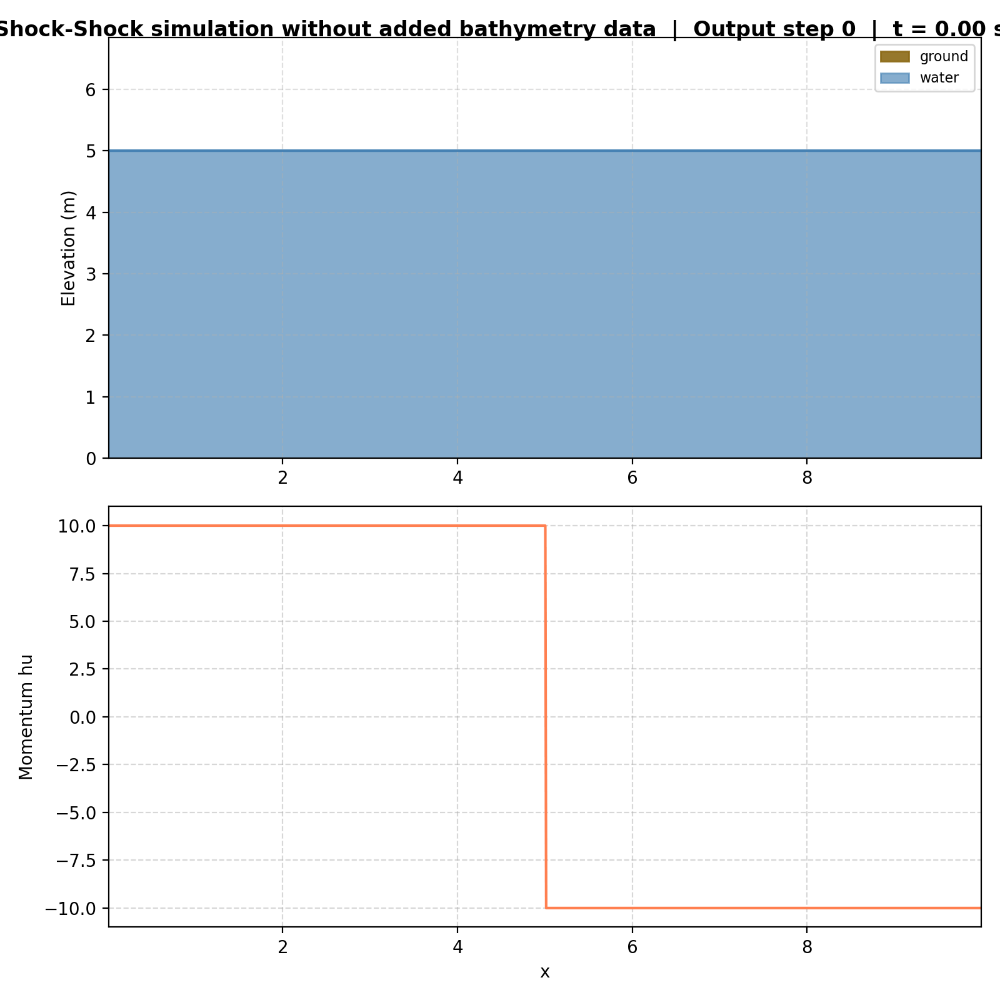
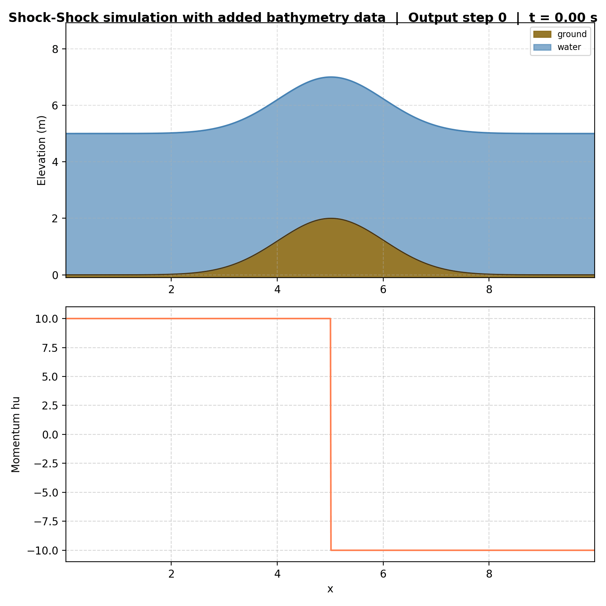
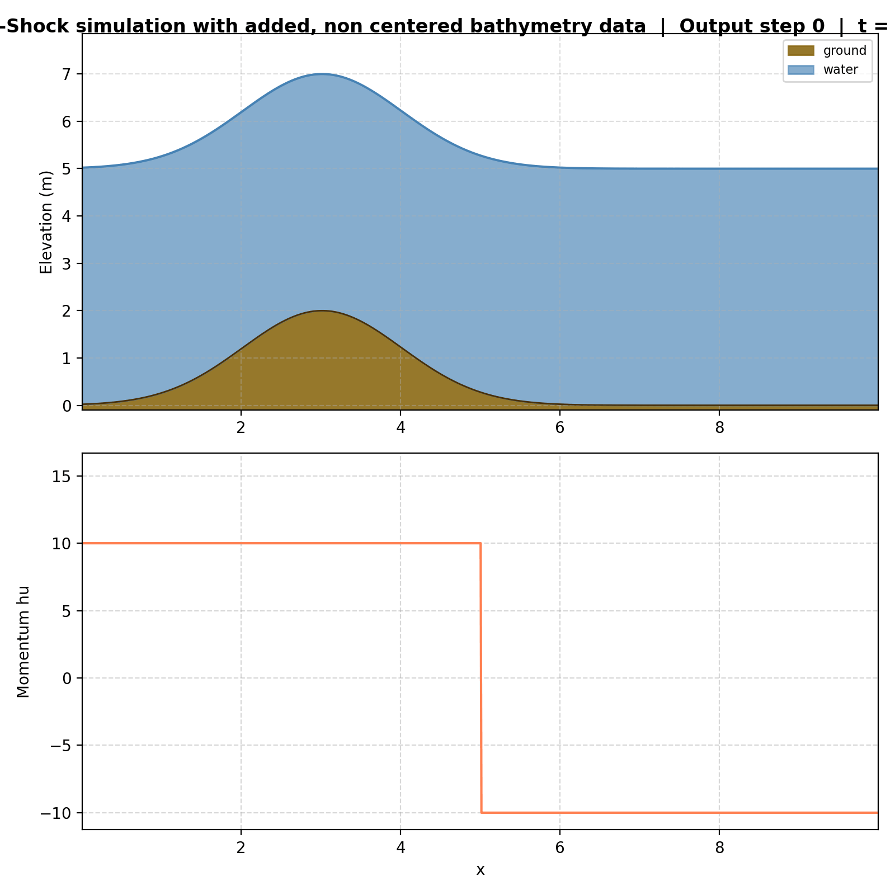
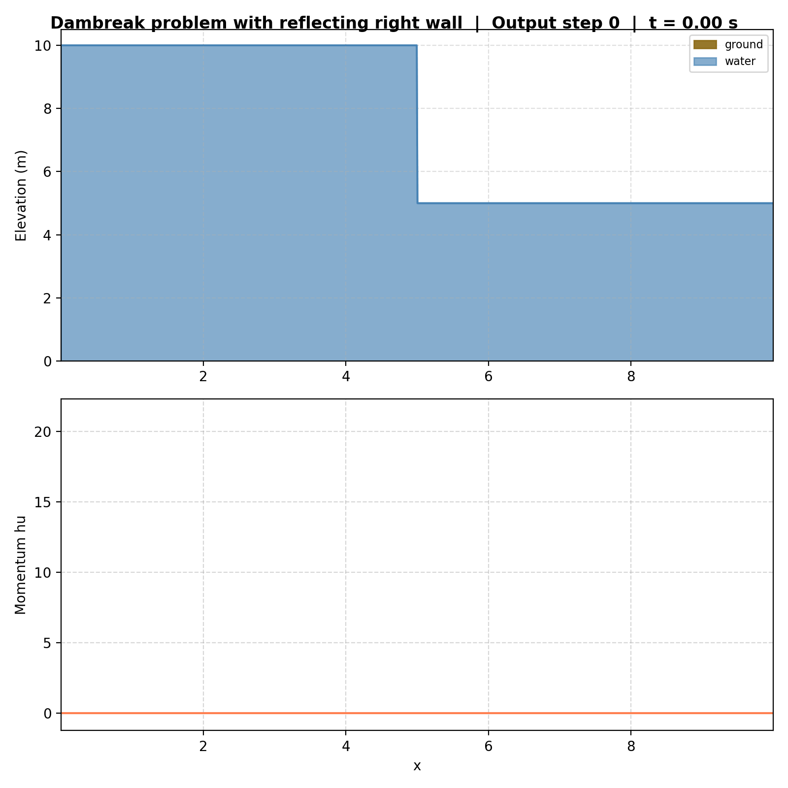
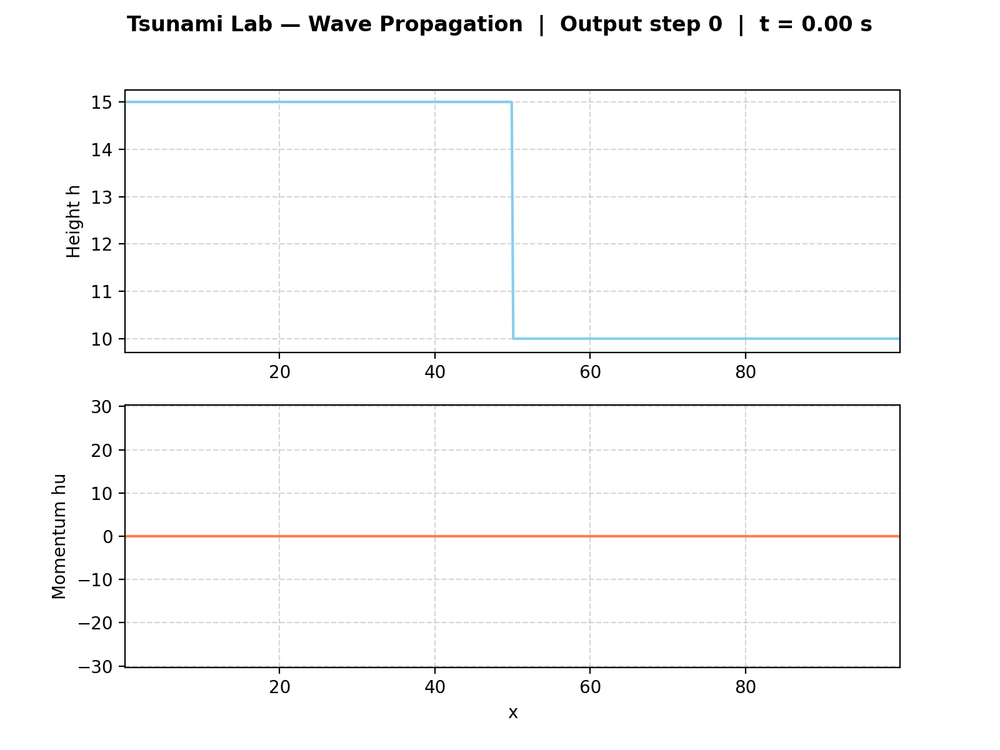
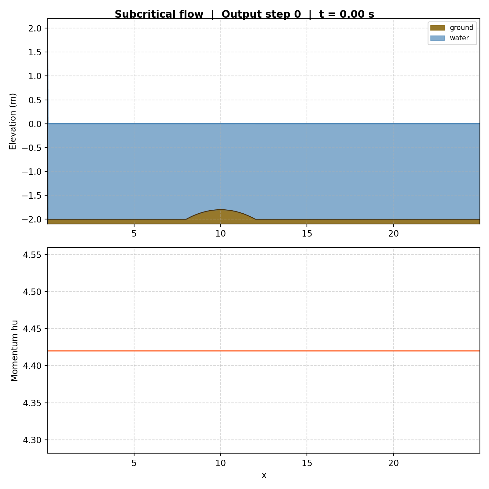
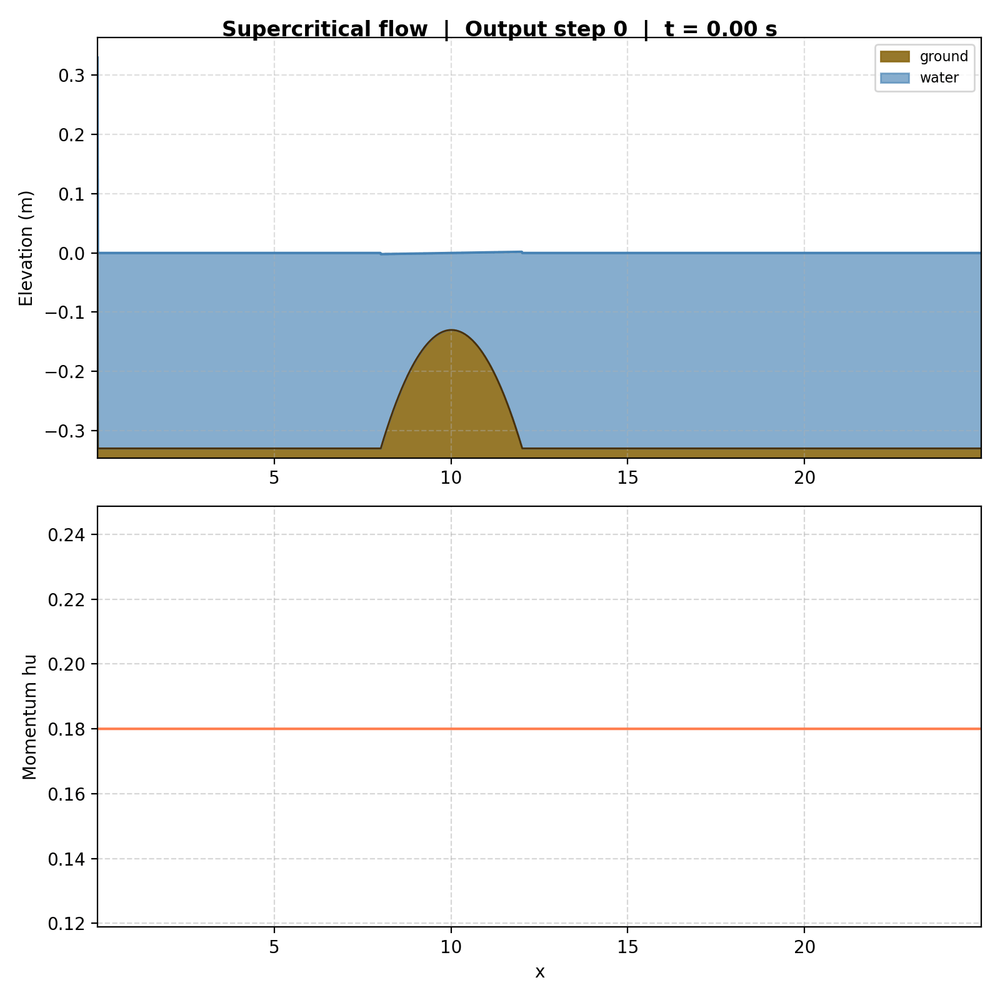
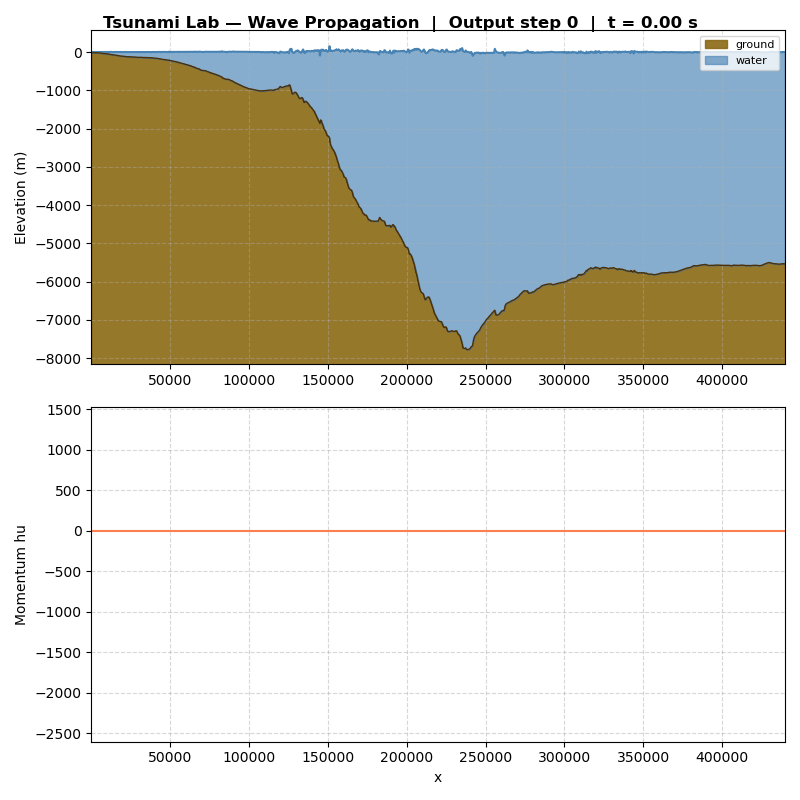
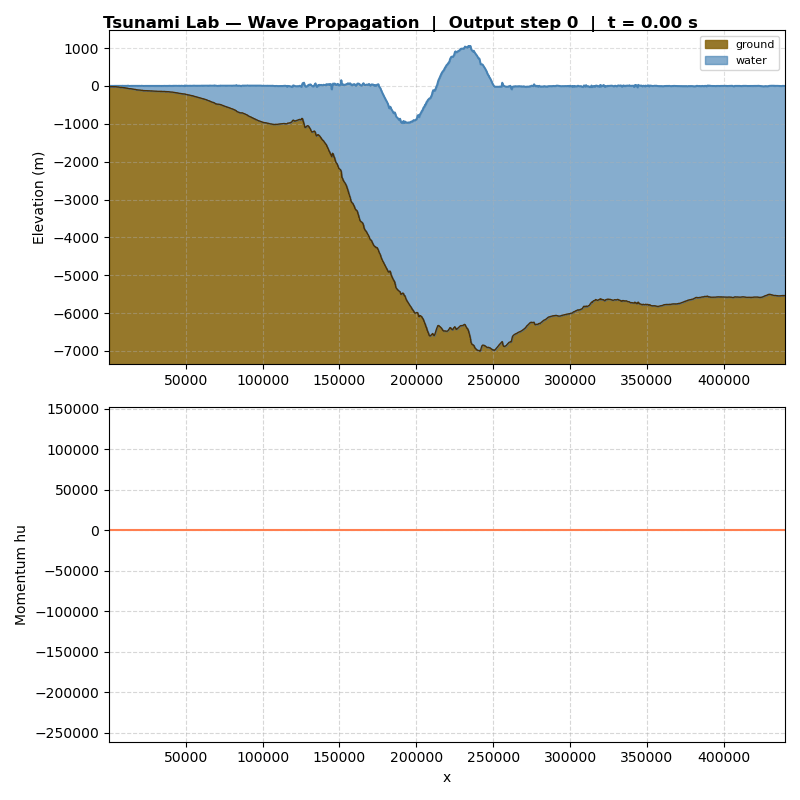

3. Bathymetry & Boundary Conditions
====================================

3.2. Reflecting Boundary Conditions
-------------------------------------

Implementation
""""""""""""""

For reflecting boundaries (3.2.1) we added a
``BoundaryCondition`` enum (``Outflow`` / ``Reflecting``) and a
new method ``setGhost(left, right)`` on ``WavePropagation1d``.
A reflecting ghost cell copies :math:`h` and negates :math:`hu`;
an outflow cell copies both.
``setGhostOutflow()`` now simply calls
``setGhost(Outflow, Outflow)``.

The boundary type per side is selected via the CLI flags ``--bc-left`` / ``--bc-right``
(``outflow`` / ``reflecting``, default ``outflow``).

For 3.2.2 a standard ``DamBreak`` with a reflecting right boundary is sufficient —
the reflection produces the same behaviour as a symmetric ShockShock problem at the wall.

Unit Tests
""""""""""

``[WaveProp1dReflecting]`` checks the three boundary combinations
(``Reflecting/Reflecting``, ``Outflow/Reflecting``,
``setGhostOutflow`` ≡ ``Outflow/Outflow``) and verifies that
:math:`h` is copied and :math:`hu` is negated only on reflecting sides.

Results
"""""""

3.1 Non-zero Source Term
-------------------------

Example with non-zero source term (3.1.2)
""""""""""""""""""""""""""""""""""""""""""""""""
**Setup**
To illustrate the effect of bathymetry, the :class:``ShockShock1d`` setup was
extended with an optional Gaussian bathymetric feature of the form
:math:`b(x) = A \cdot \exp\!\left(-\frac{(x-x_0)^2}{2\sigma^2}\right)`,
controlled by amplitude :math:`A`, center :math:`x_0`, and width :math:`\sigma`.
Setting :math:`A = 0` recovers the original flat-bottom shock-shock problem.

|ss| |ssb| |ssbnc|

Setup: ``DamBreak 15 10`` (dam position per scenario).
Upon impact with a wall the momentum does **not** simply reverse —
the water briefly backs up (:math:`u \to 0`), then a new shock with
increased water height travels back.

One-sided reflection (right boundary):

Two-sided reflection (waves bouncing between both walls):

3.3. Hydraulic Jumps
---------------------

Subcritical Flow (3.3.1/3.3.2)
""""""""""""""""""""""""""""""

The subcritical setup uses a parabolic hump over the interval :math:`x \in (8, 12)`
on the domain :math:`(0, 25)` with bathymetry

.. math::

   b(x) = \begin{cases}
   -1.8 - 0.05 (x-10)^2 & \text{if } x \in (8,12) \\
   -2 & \text{else}
   \end{cases}

and initial conditions :math:`h(x, 0) = -b(x)`, :math:`hu(x, 0) = 4.42`.

**Maximum Froude number at t = 0**

The Froude number is defined as

.. math::

   F(x) := \frac{u}{\sqrt{g h}} = \frac{hu}{h \sqrt{g h}}

Since :math:`hu = 4.42` is constant and :math:`h = -b(x)`, the Froude number is
maximized where :math:`h` is minimal, i.e., at the hump peak :math:`x = 10` where
:math:`h(10) = 1.8`.

.. math::

   F_{\max} = \frac{4.42}{1.8 \cdot \sqrt{9.80665 \cdot 1.8}}
            = \frac{4.42}{1.8 \cdot 4.201}
            \approx 0.584

Since :math:`F_{\max} < 1` everywhere, the flow remains subcritical throughout
the entire domain at :math:`t = 0`.

Supercritical Flow (3.3.1/3.3.2)
""""""""""""""""""""""""""""""""

The supercritical setup uses the same domain with bathymetry

.. math::

   b(x) = \begin{cases}
   -0.13 - 0.05 (x-10)^2 & \text{if } x \in (8,12) \\
   -0.33 & \text{else}
   \end{cases}

and initial conditions :math:`h(x, 0) = -b(x)`, :math:`hu(x, 0) = 0.18`.

**Maximum Froude number at** :math:`t = 0`

At the hump peak :math:`x = 10` the water height is :math:`h(10) = 0.13`.
Away from the hump the water height is :math:`h = 0.33`. The Froude numbers are:

.. math::

   F(10) = \frac{0.18}{0.13 \cdot \sqrt{9.80665 \cdot 0.13}} \approx 1.23
   \qquad
   F_{\text{flat}} = \frac{0.18}{0.33 \cdot \sqrt{9.80665 \cdot 0.33}} \approx 0.30

The flow transitions from subcritical (:math:`F < 1`) in the flat regions to
supercritical (:math:`F > 1`) over the hump peak. The location of the maximum
Froude number is :math:`x = 10` with :math:`F_{\max} \approx 1.23`.

**Hydraulic jump and failure to converge**

In the supercritical case a stationary shock — a hydraulic jump — forms
downstream of the hump where the flow transitions back from supercritical to
subcritical. Analytically, conservation of mass in a stationary 1D flow without
sources requires :math:`hu = \text{const} = 0.18` everywhere.

The f-wave solver, however, fails to converge to this analytical solution.
At :math:`t \approx 10`, the domain has settled into a spurious steady state:
the momentum :math:`hu` takes the value :math:`\approx 0.1248` left of the
hump, jumps to :math:`\approx 0.148` at the hydraulic jump located near
:math:`x \approx 11.5`, and returns to :math:`\approx 0.1248` right of the
hump — instead of the analytically expected constant value of :math:`0.18`
everywhere. This discrepancy persists regardless of grid refinement,
demonstrating a known limitation of the standard f-wave approach for
supercritical flows with hydraulic jumps.

3.4. 1D Tsunami Simulation
----------------------------

Bathymetry Data Extraction (3.4.1)
""""""""""""""""""""""""""""""""""

We extract bathymetry data from the GEBCO 2025 Grid using GMT.
The workflow is automated in ``scripts/extract_bathymetry.sh``:

.. code-block:: bash

   ./scripts/extract_bathymetry.sh tohoku --map --pdf

.. code-block:: bash

   ./extract_bathymetry.sh nordsee \
        --region 6/15/53/56 \
        --profile-start 8.7/53.87 \
        --profile-end 8.7/56.0 \
        --sampling 500 \
        --map --pdf

The script downloads the GEBCO data if not present, cuts the specified
region with ``gmt grdcut``, extracts a 1D profile via ``gmt grdtrack``,
and converts the output to CSV. Optionally it generates a map with
coastlines and the profile line overlaid.

For the domain between :math:`p_1 = (141.024949, 37.316569)` and
:math:`p_2 = (146.0, 37.316569)` at 250 m sampling, the extraction
yields 1903 data points. The profile CSV is stored in ``ressources/``,
map visualizations go to ``simulations/visualizations/<name>/``.

CSV Reader (3.4.2)
""""""""""""""""""

We extended ``tsunami_lab::io::Csv`` with a static ``read`` method that parses
bathymetry CSV files (format: ``longitude,latitude,distance,bathymetry``).
The reader skips comment lines (``#``) and the header, converts the distance
column from km to metres, and returns raw arrays for position and bathymetry.

TsunamiEvent1d Setup (3.4.3)
""""""""""""""""""""""""""""

The new setup ``setups::TsunamiEvent1d`` takes a CSV file path as input and
initializes the simulation with :math:`\delta = 20\,\text{m}` to ensure a minimum water height everywhere,
avoiding numerical issues from dry cells. The artificial displacement is:

.. math::

   d(x) = \begin{cases}
   10 \cdot \sin\!\left(\frac{x - 175000}{37500}\,\pi + \pi\right)
     & \text{if } 175000 < x < 250000 \\
   0 & \text{else}
   \end{cases}

The setup uses linear interpolation between CSV data points for arbitrary
query positions.

Simulation Results (3.4.4)
""""""""""""""""""""""""""

We run the simulation with:

.. code-block:: bash

   ./build/tsunami_lab -n 1000 -d 440000 -t 3600 \
     --bc-left reflecting \
     -p TsunamiEvent1d ressources/tohoku_bathymetry_profile.csv

With the default displacement amplitude of 10 m, the wave is barely visible in
the visualization. This is physically expected: in the open ocean (depth
:math:`\approx 5000\,\text{m}`), a tsunami wave is only a few metres high.
The wave-to-depth ratio is on the order of :math:`10/5000 = 0.2\%`, making it
nearly invisible at the scale of the full bathymetry cross-section.

Modified Displacement (3.4.5, optional)
"""""""""""""""""""""""""""""""""""""""

Increasing the displacement amplitude by a factor of 1000
(i.e., :math:`d_{\max} = 10000\,\text{m}`) produces a clearly visible wave.
The wave propagates in both directions from the displacement region: the
rightward wave leaves the domain through the outflow boundary, while the
leftward wave travels toward shore and reflects off the left boundary
(reflecting BC).

The higher displacement demonstrates the expected behavior: larger initial
perturbations produce proportionally stronger waves, and the reflecting
boundary correctly prevents water from leaving the domain at the coast.

Individual Contributions
-------------------------

- **Yannik Köllmann:** Implementation of 3.4 (bathymetry extraction script,
  CSV reader, ``TsunamiEvent1d`` setup, simulation runs and visualizations).
- **Jan Vogt:** Implementation of 3.2.1 (``BoundaryCondition``,
  ``setGhost``, CLI flags, ``[WaveProp1dReflecting]`` tests), reflection
  setup and visualizations for 3.2.2, as well as this documentation.
- **Mika Brückner:** Integration of bathymetry support into the project (3.1).
  Integration of optional bathymetry data into the ``ShockShock1d`` setup (3.1.2) and generation of corresponding visualizations.
  Implementation of subcritical and supercritical flow setups (3.3) and related
  visualizations. Computation of maximum Froude numbers and analysis of hydraulic
  jump convergence issues (3.3.1 / 3.3.3).