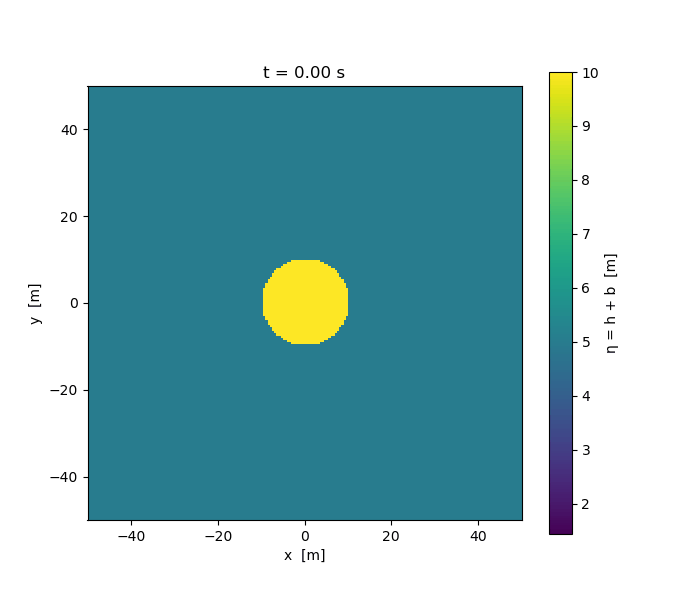
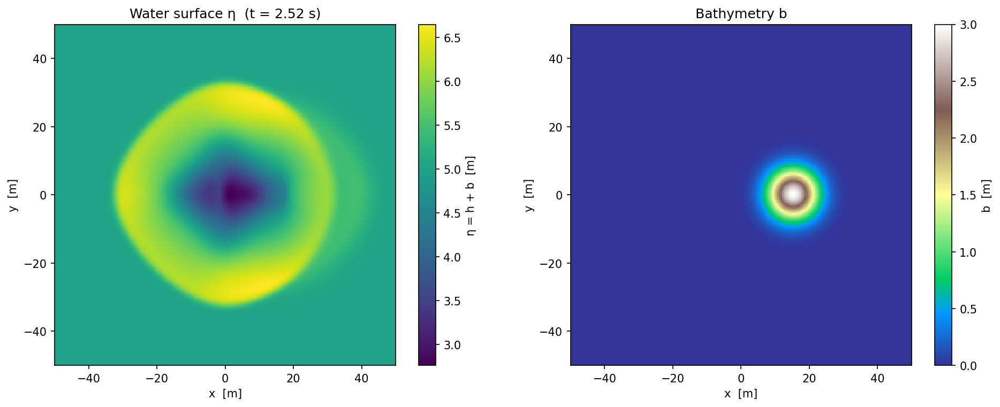
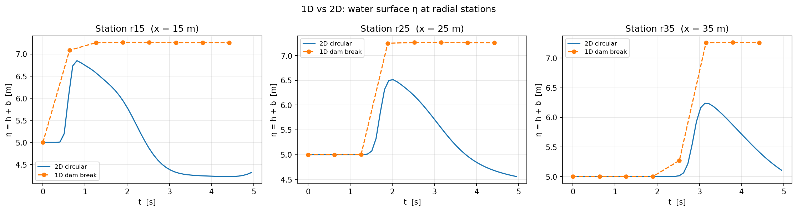

4. Two-Dimensional Solver
==================

Implementation
---------------

Two-Dimensional Wave Propagation (``WavePropagation2d``)
~~~~~~~~~~~~~~~~~~~~~~~~~~~~~~~~~~~~~~~~~~~~~~~~~~~~~~~~~

We extended the solver to two spatial dimensions by implementing the class
``patches::WavePropagation2d`` (``src/patches/WavePropagation2d/``), which
applies the **unsplit method** to the two-dimensional shallow water equations.

**Memory layout.**
The patch allocates two flat 1-D buffers (double-buffering for time-stepping)
of size :math:`(n_x + 2)(n_y + 2)` for each of the three conserved quantities
:math:`h`, :math:`hu`, :math:`hv`, and a single flat buffer of the same size
for the bathymetry :math:`b`.
A 2-D cell :math:`(i_x, i_y)` maps to the 1-D index

.. math::

   \text{idx}(i_x, i_y) = i_x + i_y \cdot (n_y + 2).

The extra two cells in each direction are the ghost cells.

**Unsplit time step.**
Each call to ``timeStep(i_scaling)`` performs two sweeps over the interior cells
using the existing f-wave solver:

1. **X-sweep** — iterates over all vertical edges :math:`(i_x + \tfrac{1}{2},\, i_y)`.
   For each edge the f-wave solver is called with the left/right states
   :math:`(h, hu, b)`, and the net updates :math:`A^\pm \Delta Q` are
   distributed to the adjacent cells in the :math:`x`-direction.

2. **Y-sweep** — iterates over all horizontal edges :math:`(i_x,\, i_y + \tfrac{1}{2})`.
   The f-wave solver is called with the bottom/top states
   :math:`(h, hv, b)` (the :math:`y`-momentum takes the role of the
   :math:`x`-momentum of the 1-D solver), and the net updates
   :math:`B^\pm \Delta Q` are distributed in the :math:`y`-direction.

Both sweeps update a fresh copy of the state arrays (the *next* buffer) that
was pre-filled with the *current* values at the beginning of the step.

**Boundary conditions.**
The method ``setGhost`` accepts independent conditions (outflow or reflecting)
for each of the four sides.
Reflecting boundaries negate the normal momentum component in the ghost cells
while copying height and bathymetry, so the particle velocity vanishes at the
wall.  ``setGhostOutflow`` is a convenience wrapper that applies outflow on
all four sides.

**Circular dam break setup (``CircularDamBreak2d``).**
The setup ``setups::CircularDamBreak2d``
(``src/setups/dambreak/CircularDamBreak2d.cpp``) implements the following
initial condition on :math:`[-50, 50]^2`:

.. math::

   [h, hu, hv]^T =
   \begin{cases}
     [10, 0, 0]^T & \text{if } \sqrt{(x - x_c)^2 + (y - y_c)^2} < r, \\
     [5,  0, 0]^T & \text{else.}
   \end{cases}

Default parameters are :math:`x_c = y_c = 0`, :math:`r = 10\,\text{m}`, on the domain :math:`[-50, 50]^2`.
All momenta are initialised to zero; the problem is symmetric under
rotations around the origin.

**Bathymetric obstacle.**
To illustrate two-dimensional bathymetry support, ``CircularDamBreak2d``
accepts an optional isotropic Gaussian obstacle:

.. math::

   b(x, y) = A \exp\!\left( -\frac{(x - x_o)^2 + (y - y_o)^2}{2\sigma^2} \right),

controlled by the amplitude :math:`A`, centre :math:`(x_o, y_o)`, and width
:math:`\sigma`.  Setting :math:`A = 0` (the default) yields flat bathymetry.
The obstacle perturbs the otherwise radially symmetric wave pattern and
demonstrates that the f-wave bathymetry source-term treatment works correctly
in two dimensions.

Station Output (``io::Stations``)
~~~~~~~~~~~~~~~~~~~~~~~~~~~~~~~~~~

The class ``io::Stations`` (``src/io/stations/``) collects user-defined
observation points and writes time-series output to individual ASCII-CSV
files.

**Data stored per station:**

* name (used as the CSV filename stem),
* continuous coordinates :math:`(x, y)`,
* corresponding 0-based cell indices :math:`(i_x, i_y)` computed from the
  domain origin and cell sizes at construction time.

**Output frequency.**
``write(i_simTime, h, hu, hv, b, stride)`` is designed to be called once per
time step.  It compares the current simulation time to the time of the last
write; output is only produced when the configured interval
``output_frequency`` (in seconds) has elapsed.  This makes the output
frequency independent of the (possibly variable) numerical time step.

Each CSV row contains the columns ``time``, ``h``, ``hu``, ``hv``, ``b``
read from the flat 2-D arrays at the cell that contains the station.

**XML configuration via pugixml.**
Stations are configured at runtime through an XML file parsed with the
`pugixml <https://pugixml.org/>`__ library.
The factory method ``Stations::fromXml`` reads a ``<stations>`` node of the
form:

.. code-block:: xml

   <config>
     <stations output_frequency="0.5">
       <station name="center"    x="0.0"  y="0.0"  />
       <station name="radius_10" x="10.0" y="0.0"  />
       <station name="corner"    x="40.0" y="40.0" />
     </stations>
   </config>

The ``output_frequency`` attribute (in seconds) is shared by all stations in
the block.  Each ``<station>`` element carries a ``name``, an ``x``-, and a
``y``-coordinate.  The XML schema is intentionally extensible: additional
top-level sections (e.g. ``<solver>``, ``<setup>``) can be added to the same
configuration file in later parts of the project without breaking the stations
parser.

**Runtime integration.**
The solver accepts the optional flag ``-c <config.xml>`` (or ``--config``).
When provided, ``main`` loads the XML file with pugixml, locates the
``<config><stations>`` node, and constructs a ``Stations`` object via
``fromXml``.  Station CSV files are written into a ``stations/`` sub-directory
inside the run's output directory.  ``Stations::write`` is called once per
time step; the internal frequency guard ensures output is produced only at the
configured interval, independent of the numerical time step size.  A typical
invocation looks like:

.. code-block:: bash

   ./tsunami_lab -n 200 -t 5 -p DamBreak2d -c ressources/example.stations_config.xml

Unit Tests
-----------

``WavePropagation2d`` tests (``src/patches/WavePropagation2d/WavePropagation2d.test.cpp``):

* verify that a 1-D dam-break run on a single-row 2-D grid reproduces the
  same water heights as ``WavePropagation1d`` after several time steps,
* check that outflow ghost cells are filled correctly on all four sides,
* confirm that reflecting ghost cells negate the normal momentum component.

``CircularDamBreak2d`` tests (``src/setups/dambreak/CircularDamBreak2d.test.cpp``):

* confirm that the height equals 10 m inside the circle and 5 m outside,
* check that both momentum components are zero everywhere,
* verify that the Gaussian obstacle produces a non-zero, positive bathymetry
  value at the obstacle centre and vanishes far away.

``Stations`` tests (``src/io/stations/Stations.test.cpp``):

* construct a ``Stations`` object via ``fromXml`` from a minimal XML string,
* verify that the correct number of stations is registered,
* call ``write`` twice with a time gap smaller than ``output_frequency`` and
  confirm that only one row is written,
* call ``write`` again after a sufficient time gap and confirm that a second
  row appears.

Results & Visualizations
-------------------------

Circular Dam Break (flat bathymetry)
~~~~~~~~~~~~~~~~~~~~~~~~~~~~~~~~~~~~~

We ran the circular dam break on the domain :math:`[-50, 50]^2` with
:math:`200 \times 200` cells (:math:`\Delta x = \Delta y = 0.5\,\text{m}`),
end time :math:`t = 5\,\text{s}`, and outflow boundaries on all four sides.
The initial condition places :math:`h = 10\,\text{m}` inside the circle of
radius :math:`r = 10\,\text{m}` centred at the origin and :math:`h = 5\,\text{m}`
outside it.

   Animation of the water surface :math:`\eta = h + b` for the circular dam
   break (flat bathymetry, :math:`t = 0` to :math:`4.4\,\text{s}`).
   The wave front expands radially outward with nearly perfect circular
   symmetry, confirming that the unsplit method correctly handles both the
   :math:`x`- and :math:`y`-sweeps.

Circular Dam Break with Bathymetric Obstacle
~~~~~~~~~~~~~~~~~~~~~~~~~~~~~~~~~~~~~~~~~~~~~

To demonstrate two-dimensional bathymetry support we added an isotropic
Gaussian hump of amplitude :math:`A = 3\,\text{m}` centred at
:math:`(x_o, y_o) = (15, 0)\,\text{m}` with width :math:`\sigma = 5\,\text{m}`:

.. math::

   b(x,y) = 3 \exp\!\left( -\frac{(x-15)^2 + y^2}{50} \right).

   Water surface :math:`\eta` (left) and bathymetry :math:`b` (right) at
   :math:`t \approx 2.5\,\text{s}` with the Gaussian obstacle at
   :math:`(15, 0)\,\text{m}`.
   The obstacle breaks the circular symmetry: the wave is partially reflected
   backward and the transmitted wave is locally elevated, consistent with
   the f-wave bathymetry source-term treatment.

Comparison of 1D and 2D Solvers at Stations
~~~~~~~~~~~~~~~~~~~~~~~~~~~~~~~~~~~~~~~~~~~~~

To validate the two-dimensional solver we exploit the radial symmetry of the
circular dam break.  Along the positive :math:`x`-axis the problem reduces to
a one-dimensional dam break whose outward-propagating wave should match the
2D solution at the same radial distance.

We place three stations at :math:`r \in \{15, 25, 35\}\,\text{m}` from the
origin along :math:`y = 0` and run:

* **2D** — circular dam break as described above, with station output every
  :math:`0.1\,\text{s}` (via ``ressources/comparison_stations.xml``).
* **1D** — ``DamBreak`` with :math:`h_L = 10\,\text{m}`, :math:`h_R = 5\,\text{m}`,
  dam at :math:`x = 10\,\text{m}` (the circle boundary), domain
  :math:`[0, 100]\,\text{m}`, :math:`\Delta x = 0.5\,\text{m}`.
  The 1D solution is sampled at :math:`x \in \{15, 25, 35\}\,\text{m}` from
  the snapshots.

   Water surface :math:`\eta(t)` at stations :math:`r = 15, 25, 35\,\text{m}`
   from the dam centre.  The 2D circular solver (solid) and the 1D solver
   (dashed, sampled from snapshots) agree on the arrival time and initial
   wave height at all stations.  The 2D amplitude decreases more rapidly
   with distance because circular waves spread energy over an ever-growing
   circumference (:math:`\sim 1/\sqrt{r}`), while the 1D wave maintains its
   amplitude.  This behaviour is the expected physical difference between a
   planar and a circular dam break.

Individual Contributions
-------------------------

- **Yannik Köllmann:** Implementation of the ParaView-based 2D visualization
  script, matplotlib scripts for the animation, obstacle snapshot, and 1D vs 2D station-comparison figures
  Simulation runs for the circular dam break
- **Jan Vogt:** Implementation of the ``CircularDamBreak2d`` setup including Unit-tests.
- **Mika Brückner:** Implementation and integration of the ``WavePropagation2d`` class including Unit-tests.
  Implementation and integration of the ``Stations`` class including Unit-tests.
