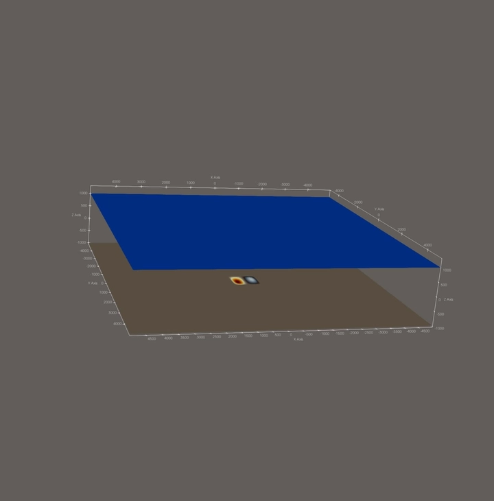
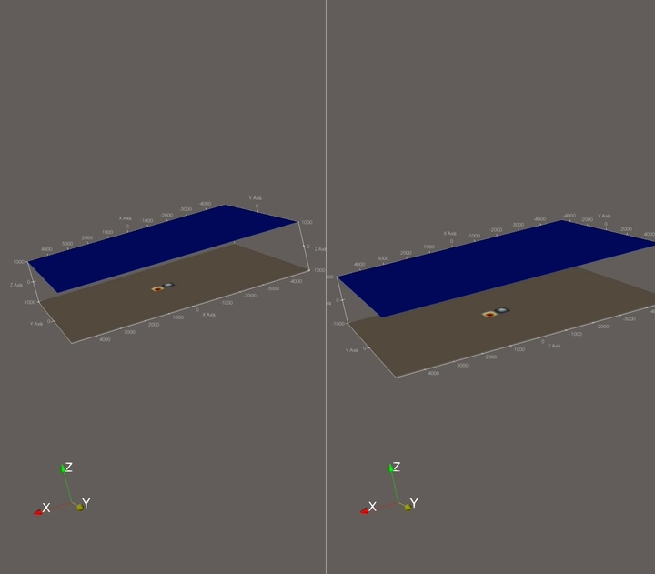

5. Large Data Input and Output
===============================

Implementation
---------------

Build System (5.1.1)
~~~~~~~~~~~~~~~~~~~~~

netCDF and its dependencies (``zlib``, ``HDF5``) are provided via the Nix
shell in ``shell.nix``.  ``SConstruct`` discovers the installation by
querying ``nc-config --prefix`` at build time and links against ``-lnetcdf``.

netCDF Writer (5.1.2)
~~~~~~~~~~~~~~~~~~~~~~

The class ``io::NetCDF`` (``src/io/netcdf/``) writes simulation snapshots to a
single COARDS-compliant file.  The dimensions ``time`` (``NC_UNLIMITED``),
``x`` and ``y`` carry standard attributes; the time variable uses
``units = "seconds since earthquake event"`` to trigger ParaView's time
slider.  The data variables ``h``, ``hu``, ``hv`` are 3-D
``(time, x, y)``; the bathymetry ``b`` is a static 2-D variable written only
once on the first call to ``write``.

``write`` copies only the **interior** cells into a contiguous buffer using
the patch's ghost-cell stride and appends one slice along the unlimited time
dimension per call.

netCDF Reader (5.2)
~~~~~~~~~~~~~~~~~~~~

``NetCDF::read`` parses a COARDS-style 2-D scalar field. It supports both
the canonical ``(y, x)`` and the transposed ``(x, y)`` dimension order and
emits the output in row-major :math:`o\_z[i_y \cdot n_x + i_x]` layout,
transposing on the fly if needed.

Two-Dimensional Tsunami Setup (5.2)
~~~~~~~~~~~~~~~~~~~~~~~~~~~~~~~~~~~~

``setups::TsunamiEvent2d`` (``src/setups/tsunamievent2d/``) consumes two
netCDF files (bathymetry, displacement) and implements the initial conditions
from the assignment:

.. math::

   \begin{split}
   h  &= \begin{cases}
           \max(-b_\text{in},\, \delta), & b_\text{in} < 0 \\
           0, & \text{else}
         \end{cases}\\
   hu &= 0, \quad hv = 0\\
   b  &= \begin{cases}
           \min(b_\text{in},\, -\delta) + d, & b_\text{in} < 0 \\
           \max(b_\text{in},\,  \delta) + d, & \text{else}
         \end{cases}
   \end{split}

with :math:`\delta = 20\,\text{m}`.

Queries between input samples use a binary-search **nearest-neighbour**
lookup (``closestIdx``).  ``getDisplacement`` returns :math:`d = 0` outside
the displacement file's extent.  The domain getters return the left/bottom
edge :math:`x_\text{file}[0] - \tfrac{1}{2}\Delta x` and the full extent
:math:`n \cdot \Delta x`, since the file coordinates are cell centres.

The CLI accepts ``-p TsunamiEvent2d <bath.nc> <displ.nc>``.  When ``-d`` is
omitted, the domain is taken from the bathymetry file and ``ny`` is chosen so
that cells stay square.  The sampling loop queries the setup at cell centres,
matching the coordinates written by ``io::NetCDF``.

Unit Tests
-----------

``NetCDF`` (``src/io/netcdf/NetCDF.test.cpp``):

* round-trip write of a :math:`4 \times 3` patch with ghost-cell stride and
  two time steps, verified through the raw netCDF C API,
* read of a synthetic COARDS file with ``(y, x)`` dimension order,
* read of the same file with transposed ``(x, y)`` order — the reader
  must produce identical row-major output.

``TsunamiEvent2d`` (``src/setups/tsunamievent2d/TsunamiEvent2d.test.cpp``):

* ``closestIdx`` returns the correct index for exact, equidistant, and
  out-of-range queries,
* nearest-neighbour bathymetry lookup at exact and intermediate grid points,
* ``getDisplacement`` is :math:`0` outside the displacement grid,
* ``getHeight`` / ``getBathymetry`` reproduce Eq. 5.2.1 for under-water and
  above-water cells, with and without displacement,
* domain getters return the full ``n \cdot \Delta x`` extent.

Cross-check (``TsunamiEvent2dCompare.test.cpp``): the file-based setup must
match the analytic ``ArtificialTsunami2d`` to :math:`10^{-4}\,\text{m}` at the
displacement-grid cell centres and outside the displacement square.  The test
is skipped when the input data is not present.

The full suite is **48 test cases / 52 967 assertions**.

Results & Visualizations
-------------------------

Tsunami in a Swimming Pool
~~~~~~~~~~~~~~~~~~~~~~~~~~

Run the artificial-tsunami input
(:math:`10 \times 10\,\text{km}` pool at :math:`-100\,\text{m}` with a
:math:`1 \times 1\,\text{km}` displacement square):

.. code-block:: bash

   ./build/tsunami_lab -n 500 -t 1000 -p TsunamiEvent2d \
       resources/artificial_tsunami_2d/artificialtsunami_bathymetry_1000.nc \
       resources/artificial_tsunami_2d/artificialtsunami_displ_1000.nc

   Swimming-pool tsunami.  The wave radiates outward from the displacement square.

Cross-Check Against the Analytic Setup
~~~~~~~~~~~~~~~~~~~~~~~~~~~~~~~~~~~~~~

Running the same scenario with the analytic ``ArtificialTsunami2d`` and the
file-based ``TsunamiEvent2d`` produces visually indistinguishable results.

   Side-by-side of analytic (left) and netCDF-driven (right) setup.

Individual Contributions
-------------------------

- **Yannik Köllmann:** Implementation of ``ArtificialTsunami2d`` and ``TsunamiEvent2d``
  including unit tests and command-line integration.
- **Jan Vogt:** Implementation of the netCDF reader ``NetCDF::read`` (COARDS-conformant,
  auto-handling of ``(y, x)`` and ``(x, y)`` dimension orders) including unit tests, plus
  fixes for off-by-one attribute lengths in the writer. Fixed a bug in
  ``ArtificialTsunami2d::getDisplacement`` (was a Gaussian, now implements Eq. 5.2.1
  on :math:`[-500, 500]^2`) and added the cross-check test that loads the linked
  artificial-tsunami nc files through ``TsunamiEvent2d`` and compares the result
  cell-by-cell against the analytic setup.
- **Mika Brückner:** Integration of netCDF and dependent libraries into the build system. Implementation of the netCDF writer including unit tests. Visualization of the swimming-pool tsunami and the side-by-side comparison of the analytic and file-based setups. Writing this report.
