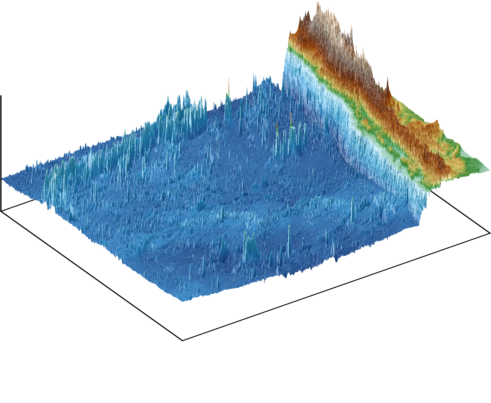
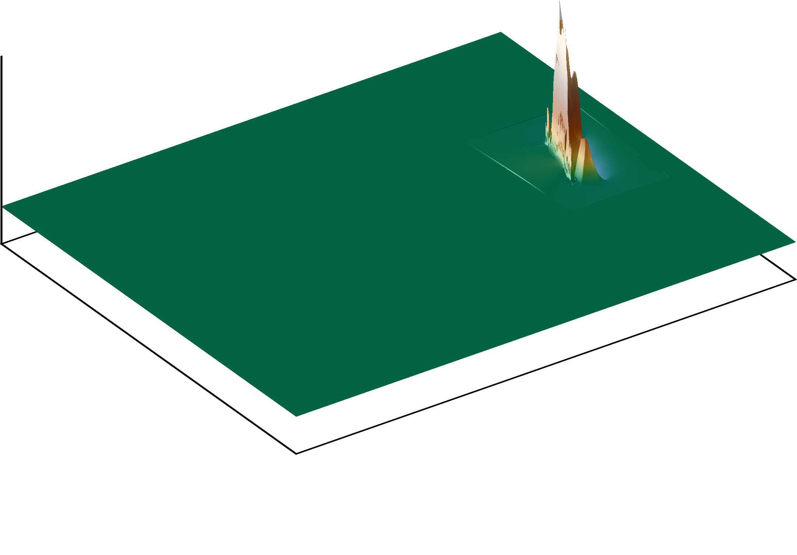
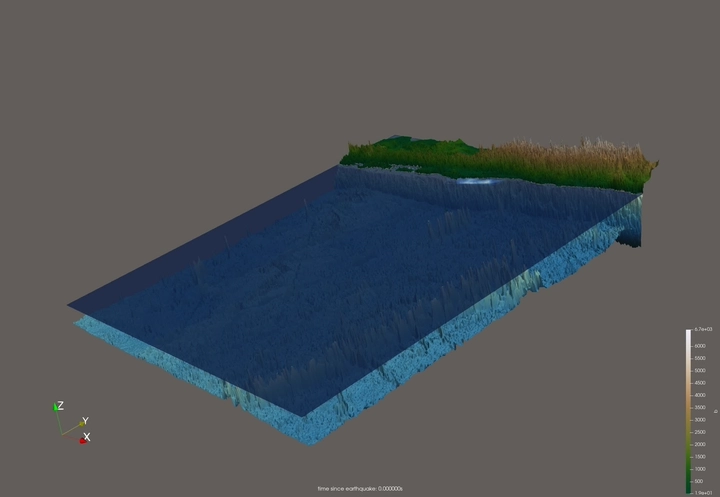
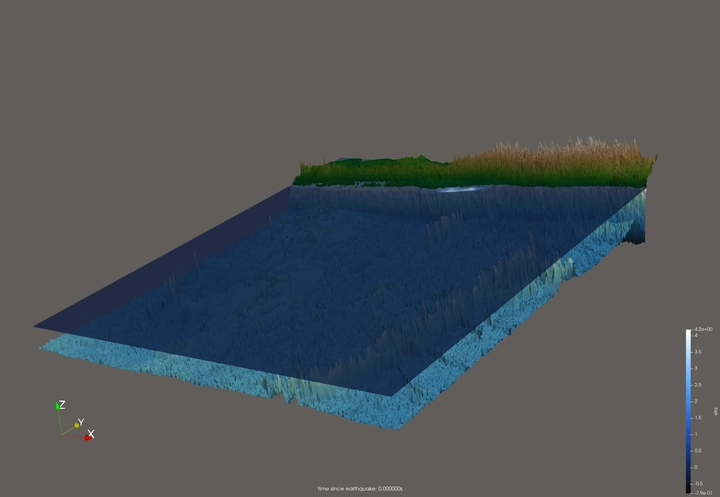
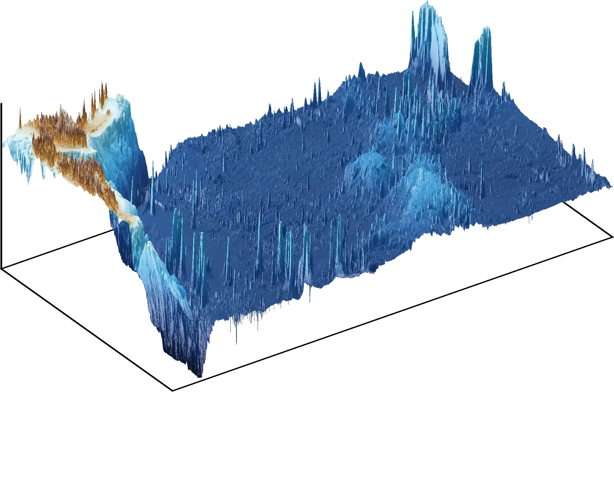
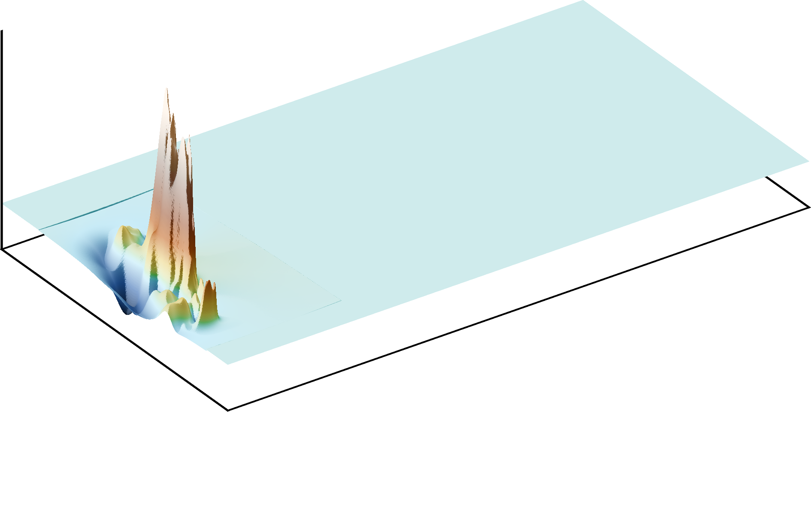
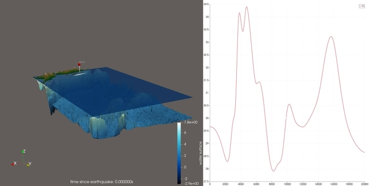
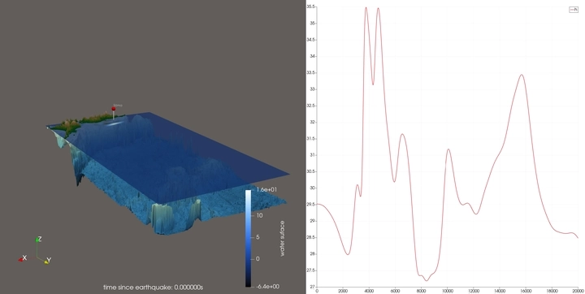

6. Tsunami Simulations
=======================

Implementation
---------------

Run Configuration
~~~~~~~~~~~~~~~~~~

The events are launched through ``-p tsunamievent2d <bath.nc> <displ.nc>``.
The computational domain is derived from the bathymetry grid (cell-centered,
COARDS); the number of cells in :math:`x` is set with ``-n`` and the cell
size follows as :math:`d_{xy} = \text{domain width} / n`, with :math:`n_y`
chosen so that cells stay square. All runs use **outflow** boundaries on all
sides and a fixed end time of :math:`20{,}000\,\text{s}`.

A station near Sōma is configured in ``ressources/soma_stations.xml`` and
recorded via ``-c``.

Bug Fixes
~~~~~~~~~~

Two bugs were uncovered while running the events. Both produced *NaN*
values that, once created, spread across the whole domain over the following
time steps ("NaN cancer") and corrupted the simulation.

**1. Water height on land (** ``TsunamiEvent2d::getHeight`` **).**
The initial height was computed unconditionally as
:math:`\max(-b_{in}, \delta)`, which placed a :math:`\delta = 20\,\text{m}`
water column even on land (:math:`b_{in} \ge 0`, up to :math:`+2124\,\text{m}`
in the Tohoku domain). This water avalanched off the "mountains" and violated
the CFL condition. The height must be **zero** on land:

.. code:: c++

    if (l_bIn < 0)
      return std::max(-l_bIn, m_delta);
    return 0; // dry land

**2. Missing wet/dry reflection (** ``FWave::netUpdates`` **).**
At the wet–dry interface the solver originally discarded the edge entirely
(both net updates set to zero when either side was dry). This neglected the
reflection at the coast, so momentum accumulated one-sidedly in thin shallow
cells (velocities up to :math:`u \approx -60\,\text{m/s}`); the cells were
over-drained until the water height went **negative** (down to
:math:`-29\,\text{m}`), and the subsequent :math:`\sqrt{h}` produced *NaN*.
The fix mirrors the dry side as a reflecting wall and only updates the wet
cell:

.. code:: c++

    if (i_hL <= 0) {           // left side dry -> reflect
      i_hL  = i_hR;
      i_huL = -i_huR;          // reflecting wall
      i_bL  = i_bR;            // -> delta b = 0, no bed-slope source at coast
      l_doUpdateLeft = false;
    } else if (i_hR <= 0) { /* mirror */ }

Mirroring the bathymetry (:math:`b_L = b_R`) additionally zeroes the
bed-slope source term :math:`\Delta x\,\Psi = -g\,\Delta b\,\bar h` across the
steep coastal step, which was the main momentum injector. After the fix the
water height never drops below :math:`0` in any cell, so no positivity clamp
is required.

Unit Tests
-----------

The land-height assertion in ``TsunamiEvent2d.test.cpp`` was corrected to
expect :math:`h = 0` for :math:`b_{in} \ge 0`. The reflecting wet/dry path is
covered by the existing ``FWave`` reflection tests. The full suite passes
(52 967 assertions in 48 test cases).

Results & Visualizations
-------------------------

2010 M 8.8 Chile Event (6.1)
~~~~~~~~~~~~~~~~~~~~~~~~~~~~~

The input bathymetry and the vertical displacement of the sea floor are
visualized below.

The event was simulated at 1500 m, 1000 m and 500 m (not shown here) resolution with outflow boundaries.
The visualizations show the free surface :math:`\eta = h + b`.

   Chile simulation at 1500 m resolution.

   Chile simulation at 1000 m resolution.

The computational demands at the studied resolutions (domain
:math:`3500\,\text{km} \times 2950\,\text{km}`, :math:`h_{max} \approx
9600\,\text{m}`, end time :math:`20{,}000\,\text{s}`):

.. list-table:: Chile — computational demands
   :header-rows: 1

   * - Resolution
     - Cells (:math:`n_x \times n_y`)
     - :math:`\Delta t`
     - Time steps
     - Cell updates
   * - 1000 m
     - 3500 × 2950 = 10.3 M
     - 1.63 s
     - 12 273
     - 1.27 × 10\ :sup:`11`
   * - 1500 m
     - 2333 × 1967 = 4.59 M
     - 2.44 s
     - 8 182
     - 3.75 × 10\ :sup:`10`

.. note::

2011 M 9.1 Tohoku Event (6.2)
~~~~~~~~~~~~~~~~~~~~~~~~~~~~~~

The input bathymetry and the vertical displacement of the sea floor are
visualized below.

The event was simulated at 1000 m and 500 m resolution with outflow boundaries.
The visualizations show the free surface :math:`\eta = h + b`; a marker indicates the Sōma station.
The right side of the plots covers the water height over time at the Sōma station.

   Tohoku simulation at 1000 m resolution.

   Tohoku simulation at 500 m resolution.

**Computational demands** (domain :math:`2700\,\text{km} \times
1500\,\text{km}`, :math:`h_{max} \approx 9611\,\text{m}`, end time
:math:`20{,}000\,\text{s}`):

.. list-table:: Tohoku — computational demands
   :header-rows: 1

   * - Resolution
     - Cells (:math:`n_x \times n_y`)
     - :math:`\Delta t`
     - Time steps
     - Cell updates
   * - 1000 m *(run)*
     - 2700 × 1500 = 4.05 M
     - 1.63 s
     - 12 280
     - 4.97 × 10\ :sup:`10`
   * - 500 m *(run)*
     - 5400 × 3000 = 16.2 M
     - 0.81 s
     - 24 560
     - 3.98 × 10\ :sup:`11`
   * - 250 m
     - 10800 × 6000 = 64.8 M
     - 0.41 s
     - 49 121
     - 3.18 × 10\ :sup:`12`

**Time until the first waves leave the domain.** With the epicenter near the
western coast, the first waves reach an open boundary through the southern
edge (the closest open water), followed by the north and finally the far
eastern Pacific boundary (1000 m run, threshold :math:`|\eta| > 0.3\,\text{m}`):

.. list-table:: Tohoku — first arrival at open boundaries (1000 m)
   :header-rows: 1

   * - Boundary
     - Time
   * - South (y = −750 km)
     - ≈ 2480 s (41 min)
   * - North (y = +750 km)
     - ≈ 3870 s (65 min)
   * - East (x = +2500 km)
     - ≈ 9540 s (159 min)

The first waves therefore leave the computational domain after roughly
**41 min** of simulated time.

Tsunami Arrival at Sōma (6.2.2)
^^^^^^^^^^^^^^^^^^^^^^^^^^^^^^

**Rule-of-thumb estimate.** Using :math:`\lambda \approx \sqrt{g\,h}` along
the bathymetry cut from the epicenter to Sōma
(``ressources/tohoku_bathymetry_profile.csv``) and integrating the travel time
:math:`\tau = \int \mathrm{d}s / \lambda` over the ocean part of the cut
(epicenter at :math:`\approx 119\,\text{km}`, lon 142.37° E) gives

.. math::

   \tau \approx 2770\,\text{s} \approx 46\,\text{min}.

This matches the historically measured arrival of the first significant wave
at Sōma (≈ 45–60 min after the rupture).

**Station measurement.** A station was placed just offshore of Sōma at the domain coordinate :math:`(-120{,}000, -50{,}000)\,\text{m}` (.._fig:tohoku_1000m: and _fig:tohoku_500m:) (water depth ≈ 28 m; the town itself is on land, where a gauge would record only zeros).
The recorded water height :math:`h`, momentum :math:`hu, hv` give:

.. list-table:: Sōma station — simulated arrival
   :header-rows: 1

   * - Quantity
     - 1000 m
     - 500 m
   * - First momentum signal
     - ≈ 2.6 min
     - ≈ 3.0 min
   * - First clear surface rise (:math:`|\eta - \eta_0| > 0.2\,\text{m}`)
     - ≈ 14.4 min
     - ≈ 14.5 min
   * - Peak amplitude
     - +4.74 m at 78.9 min
     - +5.97 m at 62.6 min

**Comparison.** The :math:`\sqrt{gh}` rule of thumb (≈ 46 min) lies between
the simulated leading edge (first noticeable rise ≈ 14 min, faster because the
deep-ocean front outruns the shallow-water integral) and the main peak
(≈ 63–79 min). The order of magnitude agrees with both the rule of thumb and
the measured data; the finer 500 m grid resolves a higher and earlier peak
(+5.97 m vs. +4.74 m) due to better-resolved shoaling.

Individual Contributions
-------------------------

- **Yannik Köllmann:** Simulation and visualization of the Chile event at 1000 m and 500 m resolution. Analysis of computational demands.
- **Jan Vogt:**
- **Mika Brückner:** Bug fixes. Implementation of visualization script for bathymetry data. Visualization of the bathymetry and sea floor displacement. Simulation and visualization of the Tohoku event at 1000 m and 500 m resolution. Analysis of the Sōma station data.
