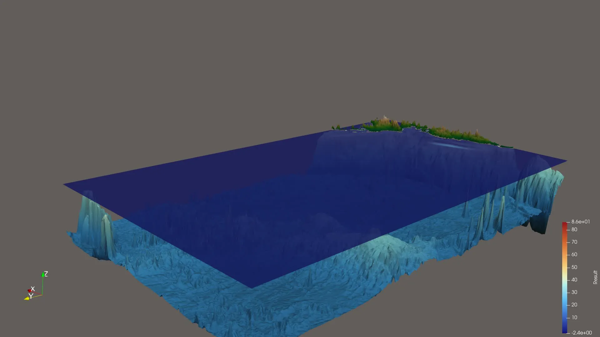

7. Checkpointing and Coarse Output
===================================

Implementation
---------------

Checkpointing (7.1)
~~~~~~~~~~~~~~~~~~~~

``io::NetCDF::writeMetadata`` stores all run parameters as global attributes
in ``solution.nc``: grid origin and cell size, :math:`\Delta t`, end time,
boundary conditions, solver, and setup name.  ``write`` calls ``nc_sync``
after every snapshot so the file is consistent even if the process is killed.

``setups::CheckPoint`` reads a checkpoint via ``NetCDF::readCheckpoint``,
which extracts the **last** time slice of ``h``, ``hu``, ``hv``, ``b`` and
all metadata. The output path is derived deterministically from the setup
and ``-n`` (overridable with ``-o``), so re-running the same command lands
on the same ``solution.nc``. At startup ``main`` calls
``NetCDF::hasCheckpoint``; if the file already contains at least one time
step the solver opens it through the append constructor, replaces the
``-p`` setup with ``CheckPoint``, restores all parameters, and resumes from
``lastSimTime`` — no extra flags needed.

To make checkpoints usable after a crash, ``main`` installs a
``SIGINT``/``SIGTERM`` handler that sets a flag instead of terminating
immediately.  The time loop checks the flag, writes one final snapshot, and
returns so the ``NetCDF`` destructor runs ``nc_close`` and finalizes the
NetCDF-4/HDF5 file cleanly.  This was necessary because a hard kill leaves
the HDF5 container in an unreadable state even with ``nc_sync``.

Coarse Output (7.2)
~~~~~~~~~~~~~~~~~~~~~

The ``io::NetCDF`` writer accepts a coarsening factor :math:`k` (CLI flag
``-k``).  A domain of :math:`m \times n` cells is written as
:math:`\lceil m/k \rceil \times \lceil n/k \rceil` output cells by averaging
each :math:`k \times k` source block.  For :math:`k = 1` the original code
path is used unchanged.

Results & Visualizations
--------------------------

The 2011 M 9.1 Tohoku event was run at 1000 m resolution
(:math:`2700 \times 1500` cells) with :math:`k = 5`, yielding
:math:`540 \times 300` output cells — a **25×** reduction per snapshot.

.. code-block:: bash

   ./build/tsunami_lab -n 2700 -t 7200 -k 5 \
       -p TsunamiEvent2d \
       ressources/chile/output/tohoku_gebco20_ucsb3_250m_bath.nc \
       ressources/chile/output/tohoku_gebco20_ucsb3_250m_displ.nc

   Tohoku simulation at 1000 m with coarsening factor :math:`k = 5`
   (540 × 300 output cells).

Individual Contributions
-------------------------

- **Yannik Köllmann:** Implementation of coarse output (averaging in
  ``NetCDF::write``, ``-k`` CLI flag). Coarse output simulation and visualization.
- **Mika Brückner:** Implementation of checkpointing: ``writeMetadata``,
  ``NetCDF::hasCheckpoint``, ``NetCDF::readCheckpoint``, ``setups::CheckPoint``,
  auto-resume logic in ``main``, ``nc_sync``.
- **Jan Vogt:** tba
