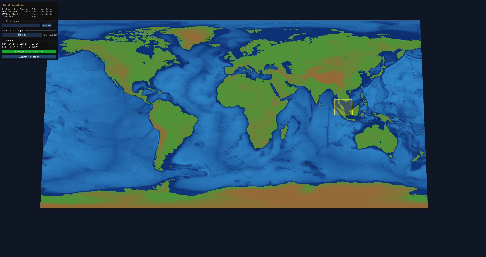
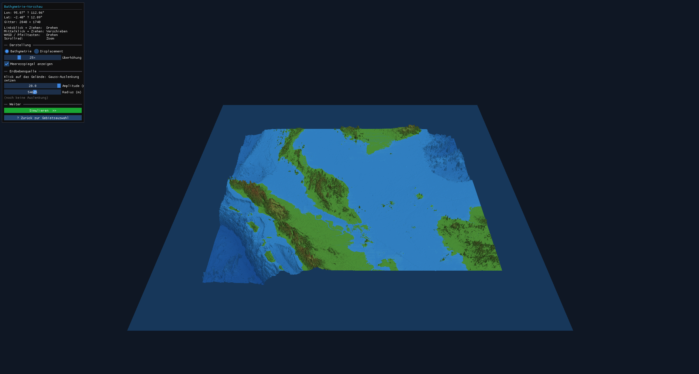
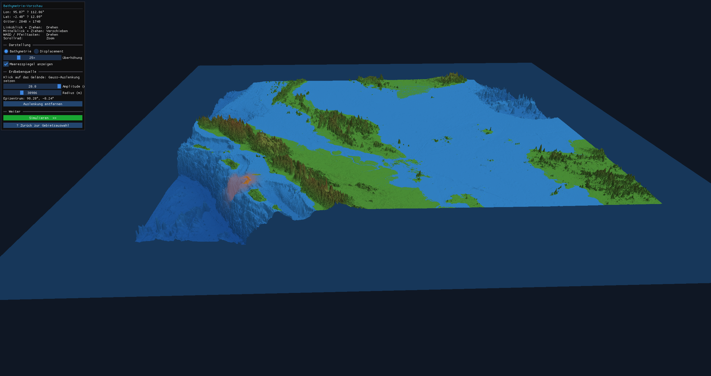

10. Individual Phase Week 1 — Real-Time OpenGL Visualization
======================================================

Overview
--------

The individual phase extends the project with an interactive 3D visualization
tool.  The user selects a geographic region on a globe, inspects its bathymetry
in a 3D preview, and will eventually watch the tsunami simulation unfold in real
time, directly in the visualizer without writing NetCDF files.

A separate binary ``tsunami_lab_viz`` is built alongside the existing pipeline;
all tests and CI remain unaffected.

Implementation
---------------

The visualizer is structured in three views:

**Globe view.**
A flat world map rendered from the GEBCO global bathymetry grid.  The user
draws a selection rectangle by clicking and dragging.  A city search field
geocodes place names and centres the camera accordingly.

   Globe view, region selection over the Sumatra/Java subduction zone.

**Region preview.**
After a region is selected, its bathymetry is loaded at native resolution and
displayed as a shaded 3D terrain mesh.  Vertical exaggeration and a sea-level
plane can be toggled in the sidebar.

   Region preview, GEBCO bathymetry rendered as a shaded 3D mesh.

**Seafloor displacement.**
A ``GaussianDisplacement`` model computes a radially symmetric vertical
displacement with configurable amplitude and spread.  Left-clicking the terrain
places the source at that position; the displacement field is evaluated per
vertex and uploaded to a separate GPU buffer.  Uplifted areas are tinted
orange-red, subsiding areas purple-blue.  A sidebar toggle switches between the
combined bathymetry view and a displacement-only view with a diverging colormap.

   Gaussian displacement, uplifted seafloor
   highlighted in orange-red.

**Build integration.**
The project migrated from SCons to CMake to integrate the required OpenGL
libraries (GLFW, GLAD, ImGui, GLM).  The ``ENABLE_VIZ`` flag keeps CI builds
headless and fast.

Individual Contributions
-------------------------

- **Yannik Köllmann:** CMake build system, OpenGL foundation (window, camera,
  shaders), globe view with mouse-driven region selection and city search,
  keyboard shortcuts.
- **Jan Vogt:** GEBCO downloader and grid reader, 3D region terrain renderer.
- **Mika Brückner:** Project plan and pitch presentation; ``GaussianDisplacement``
  model with unit tests; click-to-place displacement in the region preview;
  bathymetry/displacement view toggle with diverging colormap.
