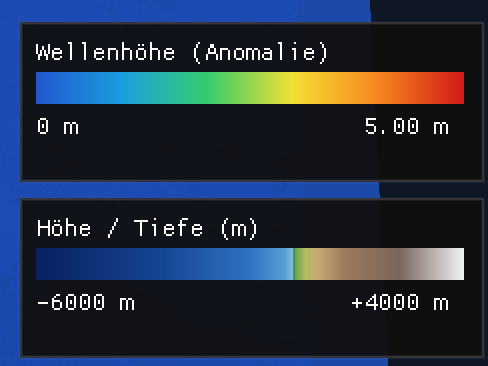

11. Individual Phase Week 2 — Live Simulation & Visual Overhaul
================================================================

Overview
--------

The visualizer now runs the 2D solver in real time: a background thread
drives the simulation while the render loop reads each completed frame
without blocking.  Alongside this, the colormap and legend system was
overhauled, and the Okada fault-displacement model was studied in
preparation for replacing the Gaussian placeholder.

Implementation
--------------

Real-time wave simulation
~~~~~~~~~~~~~~~~~~~~~~~~~~

``SolverThread`` runs ``WavePropagation2d`` on a dedicated thread and
publishes each new frame into a lock-free ``SimBuffer`` ring.  The
renderer reads the latest complete frame without stalling the solver.
Time metadata (simulated time, step count) is propagated alongside the
cell data so the HUD can show live progress.

.. raw:: html

   <video width="80%" controls loop muted playsinline>
     <source src="../_static/individual_phase/live_simulation.mp4" type="video/mp4">
     Your browser does not support the video tag.
   </video>
   
<em>Live simulation: wave height updated every rendered frame.</em>

Jet wave colormap & hypsometric terrain
~~~~~~~~~~~~~~~~~~~~~~~~~~~~~~~~~~~~~~~~~

The wave-height overlay now uses a **jet** (blue → cyan → green → yellow
→ red) scale with stable, data-driven bounds so the colour does not jump
between frames.  The bathymetry switched to a **hypsometric** palette
(deep-ocean blue → shelf → coastal green → highland brown) matching
standard cartographic convention.

Stacked legends
~~~~~~~~~~~~~~~~

The sidebar shows two stacked gradient legends, terrain elevation and wave height.

   Stacked legends: hypsometric bathymetry (bottom) and jet wave scale
   (top).

Globe view resolution control
~~~~~~~~~~~~~~~~~~~~~~~~~~~~~~~

A resolution slider in the globe view controls mesh density, allowing
finer detail at high zoom and faster interaction at coarser settings.

Shader refactor
~~~~~~~~~~~~~~~~

All inline GLSL was extracted into ``.vert`` / ``.frag`` files under
``src/visualization/shaders/``.  A thin ``Shader.h`` helper loads and
compiles them at startup.

2D solver fixes
~~~~~~~~~~~~~~~~

Two bugs that caused value explosions in the 2D X/Y sweeps were fixed in
``WavePropagation2d`` and ``main.cpp``.  Dead code and stale comments
were removed as part of the same pass.

Research — Seafloor Displacement Modelling
------------------------------------------

To replace the ``GaussianDisplacement`` placeholder with a physically
motivated source, the co-seismic seafloor deformation is modelled in three
stages: a target moment magnitude is mapped to a fault geometry via empirical
scaling laws, the fault is oriented and positioned using a subduction-zone
geometry model, and the resulting rectangular dislocation is propagated to the
surface with the Okada analytic solution.  Only the vertical component of the
deformation is retained as the tsunami initial condition.

Okada dislocation model (1985/1992)
~~~~~~~~~~~~~~~~~~~~~~~~~~~~~~~~~~~~~

`Okada (1985) <https://doi.org/10.1785/BSSA0750041135>`__ derives the static
surface displacement produced by a rectangular dislocation buried in a
homogeneous, isotropic **elastic half-space**; the companion paper
`Okada (1992) <https://doi.org/10.1785/BSSA0820021018>`__ extends the
closed-form expressions to internal deformation and cleans up several singular
cases.  The half-space assumption trades geological realism for closed-form
tractability: no volumetric mesh or numerical PDE solve is required, so the
field can be evaluated per grid cell at negligible cost.

A single fault plane is described by **nine parameters** — the horizontal
position of the centroid (:math:`x, y`), the depth of the top edge
(:math:`d`), the orientation angles strike :math:`\phi`, dip :math:`\delta`
and rake :math:`\lambda`, the along-strike length :math:`L`, the down-dip
width :math:`W`, and the slip magnitude :math:`U`.  These map directly onto the
``OkadaDisplacement`` constructor arguments.

Although Okada's solution yields the full displacement vector
:math:`(u_x, u_y, u_z)`, only the **vertical** component :math:`u_z` is
evaluated.  For tsunami generation the sea surface is displaced by the vertical
motion of the seafloor; the horizontal components merely translate an
almost-flat bed and contribute negligibly to the initial water column, so
computing :math:`u_x` and :math:`u_y` would add cost without affecting the
solver input.

Reference implementation — IPGP ``deformation-lib``
~~~~~~~~~~~~~~~~~~~~~~~~~~~~~~~~~~~~~~~~~~~~~~~~~~~~~

The Okada equations are notoriously error-prone to transcribe — sign
conventions, angle definitions and the Kronecker-delta singularities of the
1992 form all invite mistakes.  The widely used MATLAB routine
`okada85.m <https://github.com/IPGP/deformation-lib/blob/master/okada/okada85.m>`__
from the IPGP ``deformation-lib`` package serves as the reference against which
the C++ port is cross-checked: identical fault parameters must reproduce its
:math:`u_z` field to numerical precision.

Fault scaling — Wells & Coppersmith (1994)
~~~~~~~~~~~~~~~~~~~~~~~~~~~~~~~~~~~~~~~~~~~~

Okada needs the fault dimensions and slip, but a user typically specifies only
a moment magnitude :math:`M`.  The empirical regressions of
`Wells & Coppersmith (1994) <https://doi.org/10.1785/BSSA0840040974>`__ close
this gap.  Three of their all-fault-type relations supply the missing geometry:

.. math::

   \begin{aligned}
   \log_{10}(RLD) &= -2.44 + 0.59\,M \\
   \log_{10}(RW)  &= -1.01 + 0.32\,M \\
   \log_{10}(AD)  &= -4.80 + 0.69\,M
   \end{aligned}

where :math:`RLD` is the subsurface rupture length and :math:`RW` the down-dip
rupture width (both in km), and :math:`AD` is the average slip (in m).  These
feed the :math:`L`, :math:`W` and :math:`U` inputs of the Okada model directly.

Slab2 subduction geometry (Hayes et al. 2018)
~~~~~~~~~~~~~~~~~~~~~~~~~~~~~~~~~~~~~~~~~~~~~~~

The remaining parameters — the depth, strike and dip of the fault at a chosen
location — are read from **Slab2**
(`Hayes et al. 2018 <https://doi.org/10.1126/science.aat4723>`__), a global
model of subduction-zone geometry distributed as regular-grid **NetCDF**
rasters (a set of depth, dip and strike grids per zone).  Slab2 is used in two
complementary ways:

- **Parameter source.** At the click location the depth, dip and strike grids
  are sampled so the fault is oriented consistently with the real slab
  interface, rather than assuming a fixed geometry.
- **Validity mask.** Slab2 stores *NaN* wherever a cell lies outside the
  modelled slab.  This doubles as a validity test: a fault requested outside any
  subduction zone samples *NaN* and is rejected, preventing physically
  meaningless placements on non-subduction seafloor.

Instantaneous deformation assumption
~~~~~~~~~~~~~~~~~~~~~~~~~~~~~~~~~~~~~~

The Okada field is a *static* solution, applied as an **instantaneous** step
change to the seafloor at :math:`t = 0`.  Because the rupture duration (seconds
to a few minutes) is short compared with the basin-crossing travel time of the
tsunami (hours), the time history of the rupture is neglected and the full
co-seismic :math:`u_z` is imprinted on the initial sea surface in one step,
consistent with the incompressible, hydrostatic shallow-water initial
condition.

Individual Contributions
-------------------------

- **Jan Vogt:** ``SolverThread`` / ``SimBuffer`` design and
  implementation with unit tests; jet wave colormap; hypsometric terrain
  colormap; stacked legend rendering; stable colour-scale bounds; globe
  resolution control; SCons artefact cleanup.
- **Yannik Köllmann:** 2D solver bug fixes (value explosions); shader
  extraction and ``Shader.h``; time metadata in ``SolverThread``; HUD
  display of simulated time.
- **Mika Brückner:** Okada fault-displacement model — literature study,
  parameter documentation, and chapter writeup.
